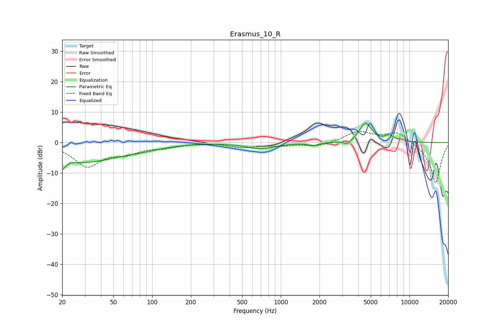

# Erasmus_10_R
See [usage instructions](https://github.com/jaakkopasanen/AutoEq#usage) for more options and info.

### Parametric EQs
Apply preamp of -6.5 dB when using parametric equalizer.

|   # | Type    |   Fc (Hz) |    Q |   Gain (dB) |
|-----|---------|-----------|------|-------------|
|   1 | Peaking |        20 | 5.78 |        -6.8 |
|   2 | Peaking |        20 | 5.85 |         3   |
|   3 | Peaking |        30 | 0.56 |        -6.1 |
|   4 | Peaking |        81 | 0.84 |        -1.2 |
|   5 | Peaking |       703 | 1.28 |        -1.9 |
|   6 | Peaking |      1786 | 4.25 |        -0.9 |
|   7 | Peaking |      3303 | 4.62 |        -1.4 |
|   8 | Peaking |      4551 | 2.95 |         6.4 |
|   9 | Peaking |      6965 | 4    |         1.8 |
|  10 | Peaking |      8679 | 3.77 |         0.6 |

### Fixed Band EQs
When using fixed band (also called graphic) equalizer, apply preamp of **-3.8 dB** (if available) and set gains manually with these parameters.

|   # | Type    |   Fc (Hz) |    Q |   Gain (dB) |
|-----|---------|-----------|------|-------------|
|   1 | Peaking |        31 | 1.41 |        -7.5 |
|   2 | Peaking |        62 | 1.41 |        -2.8 |
|   3 | Peaking |       125 | 1.41 |        -1.3 |
|   4 | Peaking |       250 | 1.41 |         0.2 |
|   5 | Peaking |       500 | 1.41 |        -1.5 |
|   6 | Peaking |      1000 | 1.41 |        -0.8 |
|   7 | Peaking |      2000 | 1.41 |        -1.3 |
|   8 | Peaking |      4000 | 1.41 |         3.6 |
|   9 | Peaking |      8000 | 1.41 |         3.5 |
|  10 | Peaking |     16000 | 1.41 |       -13.4 |

### Graphs

