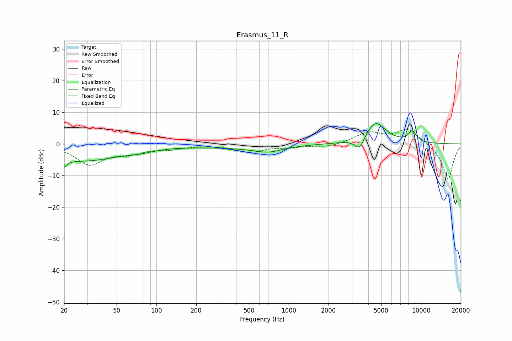

# Erasmus_11_R
See [usage instructions](https://github.com/jaakkopasanen/AutoEq#usage) for more options and info.

### Parametric EQs
Apply preamp of -6.5 dB when using parametric equalizer.

|   # | Type    |   Fc (Hz) |    Q |   Gain (dB) |
|-----|---------|-----------|------|-------------|
|   1 | Peaking |        20 | 5.86 |        -5.9 |
|   2 | Peaking |        20 | 5.91 |         3.2 |
|   3 | Peaking |        28 | 0.49 |        -5.2 |
|   4 | Peaking |        77 | 1.46 |        -0.7 |
|   5 | Peaking |       378 | 0.44 |        -0.9 |
|   6 | Peaking |       657 | 1.54 |         0.9 |
|   7 | Peaking |       683 | 1.33 |        -2.8 |
|   8 | Peaking |      3435 | 3.76 |        -4.2 |
|   9 | Peaking |      4504 | 1.78 |         7.1 |
|  10 | Peaking |      8586 | 4.21 |         3.4 |

### Fixed Band EQs
When using fixed band (also called graphic) equalizer, apply preamp of **-4.7 dB** (if available) and set gains manually with these parameters.

|   # | Type    |   Fc (Hz) |    Q |   Gain (dB) |
|-----|---------|-----------|------|-------------|
|   1 | Peaking |        31 | 1.41 |        -6.3 |
|   2 | Peaking |        62 | 1.41 |        -2.4 |
|   3 | Peaking |       125 | 1.41 |        -1.3 |
|   4 | Peaking |       250 | 1.41 |        -0.1 |
|   5 | Peaking |       500 | 1.41 |        -2.4 |
|   6 | Peaking |      1000 | 1.41 |        -0.8 |
|   7 | Peaking |      2000 | 1.41 |        -1   |
|   8 | Peaking |      4000 | 1.41 |         3.4 |
|   9 | Peaking |      8000 | 1.41 |         4.8 |
|  10 | Peaking |     16000 | 1.41 |       -11.4 |

### Graphs

