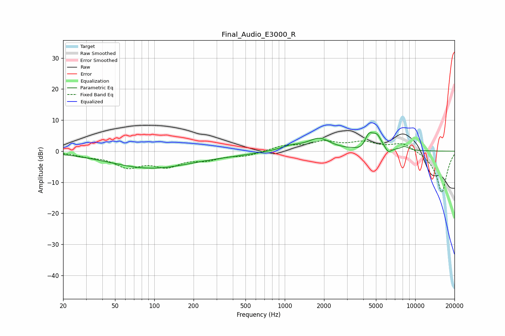

# Final_Audio_E3000_R
See [usage instructions](https://github.com/jaakkopasanen/AutoEq#usage) for more options and info.

### Parametric EQs
Apply preamp of -6.1 dB when using parametric equalizer.

|   # | Type    |   Fc (Hz) |    Q |   Gain (dB) |
|-----|---------|-----------|------|-------------|
|   1 | Peaking |        94 | 0.44 |        -5.4 |
|   2 | Peaking |       384 | 0.71 |        -0.5 |
|   3 | Peaking |      1087 | 1.81 |         1   |
|   4 | Peaking |      1210 | 1.56 |         0.5 |
|   5 | Peaking |      1841 | 1.67 |         3.8 |
|   6 | Peaking |      3974 | 3.42 |        -1.8 |
|   7 | Peaking |      4390 | 3.74 |         5.2 |
|   8 | Peaking |      5111 | 3.94 |         3.7 |
|   9 | Peaking |      6214 | 5.95 |        -1.7 |
|  10 | Peaking |      8304 | 3.9  |         1.2 |

### Fixed Band EQs
When using fixed band (also called graphic) equalizer, apply preamp of **-3.5 dB** (if available) and set gains manually with these parameters.

|   # | Type    |   Fc (Hz) |    Q |   Gain (dB) |
|-----|---------|-----------|------|-------------|
|   1 | Peaking |        31 | 1.41 |        -1.2 |
|   2 | Peaking |        62 | 1.41 |        -4.6 |
|   3 | Peaking |       125 | 1.41 |        -4.2 |
|   4 | Peaking |       250 | 1.41 |        -2.2 |
|   5 | Peaking |       500 | 1.41 |        -1.4 |
|   6 | Peaking |      1000 | 1.41 |         1.7 |
|   7 | Peaking |      2000 | 1.41 |         2.7 |
|   8 | Peaking |      4000 | 1.41 |         2.5 |
|   9 | Peaking |      8000 | 1.41 |         2.8 |
|  10 | Peaking |     16000 | 1.41 |       -13.5 |

### Graphs

