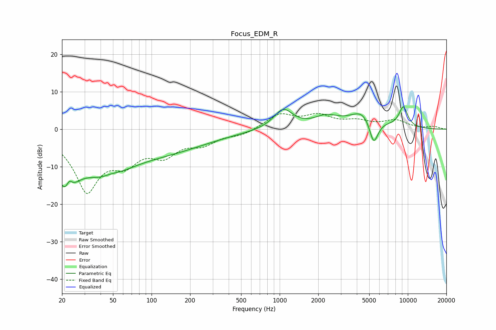

# Focus_EDM_R
See [usage instructions](https://github.com/jaakkopasanen/AutoEq#usage) for more options and info.

### Parametric EQs
Apply preamp of -6.0 dB when using parametric equalizer.

|   # | Type    |   Fc (Hz) |    Q |   Gain (dB) |
|-----|---------|-----------|------|-------------|
|   1 | Peaking |        21 | 1.66 |       -12.5 |
|   2 | Peaking |        23 | 5.96 |         3.1 |
|   3 | Peaking |        45 | 0.78 |       -10.5 |
|   4 | Peaking |        47 | 1.74 |         2.4 |
|   5 | Peaking |       133 | 0.41 |        -4.9 |
|   6 | Peaking |      1067 | 1.88 |         5.2 |
|   7 | Peaking |      2303 | 1.49 |         2.7 |
|   8 | Peaking |      4606 | 1.33 |         5.3 |
|   9 | Peaking |      5407 | 3.6  |        -7.8 |
|  10 | Peaking |      9225 | 3.57 |         5.4 |

### Fixed Band EQs
When using fixed band (also called graphic) equalizer, apply preamp of **-4.3 dB** (if available) and set gains manually with these parameters.

|   # | Type    |   Fc (Hz) |    Q |   Gain (dB) |
|-----|---------|-----------|------|-------------|
|   1 | Peaking |        31 | 1.41 |       -15.7 |
|   2 | Peaking |        62 | 1.41 |        -6.4 |
|   3 | Peaking |       125 | 1.41 |        -5.6 |
|   4 | Peaking |       250 | 1.41 |        -3.3 |
|   5 | Peaking |       500 | 1.41 |        -1.4 |
|   6 | Peaking |      1000 | 1.41 |         3.8 |
|   7 | Peaking |      2000 | 1.41 |         3.2 |
|   8 | Peaking |      4000 | 1.41 |         1.8 |
|   9 | Peaking |      8000 | 1.41 |         2.2 |
|  10 | Peaking |     16000 | 1.41 |         0.6 |

### Graphs

