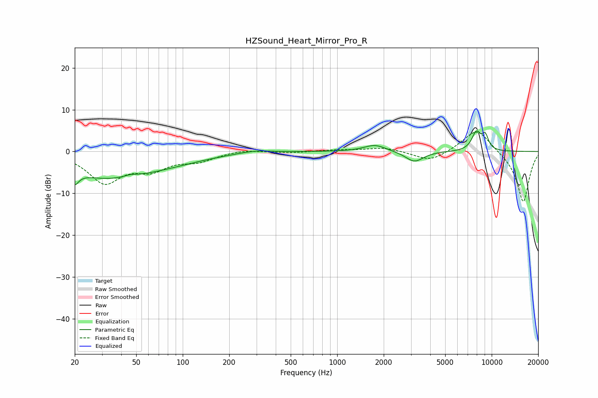

# HZSound_Heart_Mirror_Pro_R
See [usage instructions](https://github.com/jaakkopasanen/AutoEq#usage) for more options and info.

### Parametric EQs
Apply preamp of -5.0 dB when using parametric equalizer.

|   # | Type    |   Fc (Hz) |    Q |   Gain (dB) |
|-----|---------|-----------|------|-------------|
|   1 | Peaking |        20 | 5.65 |        -6.1 |
|   2 | Peaking |        20 | 5.9  |         3   |
|   3 | Peaking |        32 | 0.51 |        -5.8 |
|   4 | Peaking |        46 | 3.29 |         0.5 |
|   5 | Peaking |        84 | 0.59 |        -1.5 |
|   6 | Peaking |       294 | 1.37 |         0.7 |
|   7 | Peaking |      1755 | 2    |         1.7 |
|   8 | Peaking |      3161 | 2.45 |        -2.5 |
|   9 | Peaking |      7952 | 4.42 |         4.3 |
|  10 | Peaking |      9080 | 5.95 |         3.3 |

### Fixed Band EQs
When using fixed band (also called graphic) equalizer, apply preamp of **-4.7 dB** (if available) and set gains manually with these parameters.

|   # | Type    |   Fc (Hz) |    Q |   Gain (dB) |
|-----|---------|-----------|------|-------------|
|   1 | Peaking |        31 | 1.41 |        -7.1 |
|   2 | Peaking |        62 | 1.41 |        -3.6 |
|   3 | Peaking |       125 | 1.41 |        -2   |
|   4 | Peaking |       250 | 1.41 |         0.6 |
|   5 | Peaking |       500 | 1.41 |        -0.3 |
|   6 | Peaking |      1000 | 1.41 |         0.4 |
|   7 | Peaking |      2000 | 1.41 |         1   |
|   8 | Peaking |      4000 | 1.41 |        -2.5 |
|   9 | Peaking |      8000 | 1.41 |         5.7 |
|  10 | Peaking |     16000 | 1.41 |       -12.3 |

### Graphs

