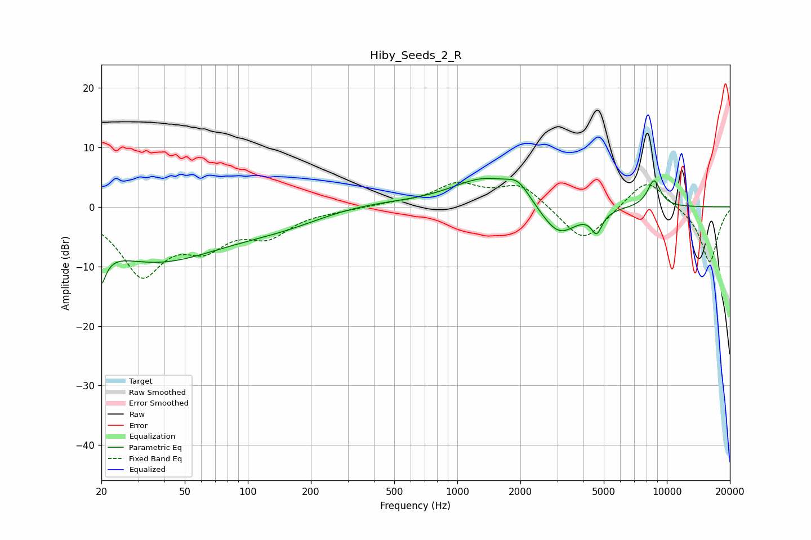

# Hiby_Seeds_2_R
See [usage instructions](https://github.com/jaakkopasanen/AutoEq#usage) for more options and info.

### Parametric EQs
Apply preamp of -4.9 dB when using parametric equalizer.

|   # | Type    |   Fc (Hz) |    Q |   Gain (dB) |
|-----|---------|-----------|------|-------------|
|   1 | Peaking |        20 | 5.61 |        -9.2 |
|   2 | Peaking |        20 | 5.96 |         3.3 |
|   3 | Peaking |        36 | 0.41 |        -8.9 |
|   4 | Peaking |       153 | 0.61 |        -2.1 |
|   5 | Peaking |       329 | 0.57 |         1.1 |
|   6 | Peaking |      1357 | 0.89 |         4.8 |
|   7 | Peaking |      1955 | 2.55 |         2.6 |
|   8 | Peaking |      3043 | 1.57 |        -5.5 |
|   9 | Peaking |      4626 | 5.44 |        -3.4 |
|  10 | Peaking |      8682 | 4    |         4.5 |

### Fixed Band EQs
When using fixed band (also called graphic) equalizer, apply preamp of **-4.2 dB** (if available) and set gains manually with these parameters.

|   # | Type    |   Fc (Hz) |    Q |   Gain (dB) |
|-----|---------|-----------|------|-------------|
|   1 | Peaking |        31 | 1.41 |       -10.9 |
|   2 | Peaking |        62 | 1.41 |        -5.2 |
|   3 | Peaking |       125 | 1.41 |        -4.2 |
|   4 | Peaking |       250 | 1.41 |        -0.4 |
|   5 | Peaking |       500 | 1.41 |         0.5 |
|   6 | Peaking |      1000 | 1.41 |         3.6 |
|   7 | Peaking |      2000 | 1.41 |         3.8 |
|   8 | Peaking |      4000 | 1.41 |        -6.3 |
|   9 | Peaking |      8000 | 1.41 |         5.1 |
|  10 | Peaking |     16000 | 1.41 |        -9.4 |

### Graphs

