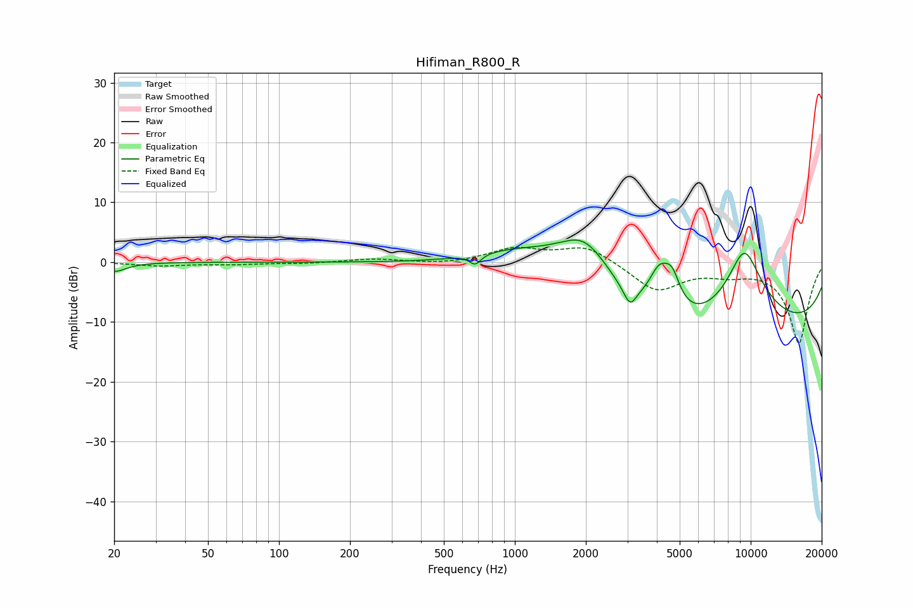

# Hifiman_R800_R
See [usage instructions](https://github.com/jaakkopasanen/AutoEq#usage) for more options and info.

### Parametric EQs
Apply preamp of -3.8 dB when using parametric equalizer.

|   # | Type    |   Fc (Hz) |    Q |   Gain (dB) |
|-----|---------|-----------|------|-------------|
|   1 | Peaking |        20 | 2.81 |        -1.6 |
|   2 | Peaking |       679 | 5.91 |        -1.7 |
|   3 | Peaking |      1062 | 0.6  |         5.7 |
|   4 | Peaking |      1987 | 1.03 |        10.5 |
|   5 | Peaking |      2955 | 3.91 |        -0.6 |
|   6 | Peaking |      3087 | 5.77 |        -2.6 |
|   7 | Peaking |      4094 | 2.99 |         6.5 |
|   8 | Peaking |      4643 | 4.05 |         4.8 |
|   9 | Peaking |      7332 | 0.18 |       -19.1 |
|  10 | Peaking |      9379 | 1.01 |        19.3 |

### Fixed Band EQs
When using fixed band (also called graphic) equalizer, apply preamp of **-2.6 dB** (if available) and set gains manually with these parameters.

|   # | Type    |   Fc (Hz) |    Q |   Gain (dB) |
|-----|---------|-----------|------|-------------|
|   1 | Peaking |        31 | 1.41 |        -0.6 |
|   2 | Peaking |        62 | 1.41 |        -0.3 |
|   3 | Peaking |       125 | 1.41 |        -0.2 |
|   4 | Peaking |       250 | 1.41 |         0.5 |
|   5 | Peaking |       500 | 1.41 |        -0.4 |
|   6 | Peaking |      1000 | 1.41 |         2.2 |
|   7 | Peaking |      2000 | 1.41 |         2.8 |
|   8 | Peaking |      4000 | 1.41 |        -4.8 |
|   9 | Peaking |      8000 | 1.41 |        -1.4 |
|  10 | Peaking |     16000 | 1.41 |       -13.5 |

### Graphs

