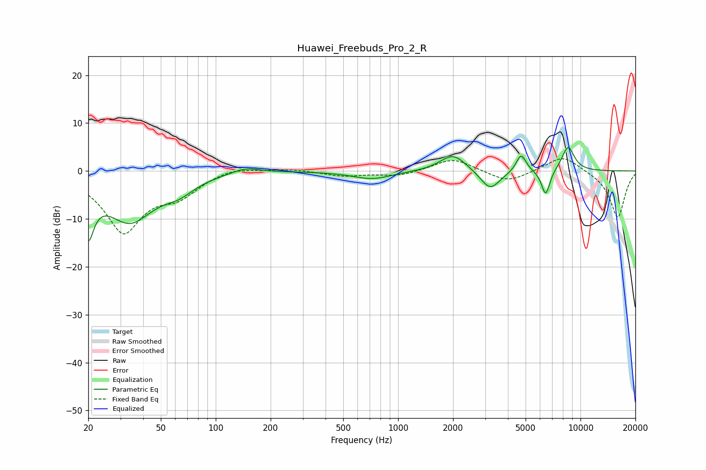

# Huawei_Freebuds_Pro_2_R
See [usage instructions](https://github.com/jaakkopasanen/AutoEq#usage) for more options and info.

### Parametric EQs
Apply preamp of -5.0 dB when using parametric equalizer.

|   # | Type    |   Fc (Hz) |    Q |   Gain (dB) |
|-----|---------|-----------|------|-------------|
|   1 | Peaking |        20 | 4.62 |        -9.8 |
|   2 | Peaking |        34 | 1    |       -10.2 |
|   3 | Peaking |        63 | 1.75 |        -2.2 |
|   4 | Peaking |       145 | 1.81 |         1.3 |
|   5 | Peaking |       720 | 1.3  |        -1.7 |
|   6 | Peaking |      2003 | 1.96 |         3.6 |
|   7 | Peaking |      3197 | 2.59 |        -4.2 |
|   8 | Peaking |      4729 | 5.1  |         3.8 |
|   9 | Peaking |      6444 | 5.79 |        -5.4 |
|  10 | Peaking |      8548 | 3.72 |         5.2 |

### Fixed Band EQs
When using fixed band (also called graphic) equalizer, apply preamp of **-2.6 dB** (if available) and set gains manually with these parameters.

|   # | Type    |   Fc (Hz) |    Q |   Gain (dB) |
|-----|---------|-----------|------|-------------|
|   1 | Peaking |        31 | 1.41 |       -12.4 |
|   2 | Peaking |        62 | 1.41 |        -4   |
|   3 | Peaking |       125 | 1.41 |         1.1 |
|   4 | Peaking |       250 | 1.41 |         0.5 |
|   5 | Peaking |       500 | 1.41 |        -1   |
|   6 | Peaking |      1000 | 1.41 |        -1.1 |
|   7 | Peaking |      2000 | 1.41 |         2.7 |
|   8 | Peaking |      4000 | 1.41 |        -2.5 |
|   9 | Peaking |      8000 | 1.41 |         3.4 |
|  10 | Peaking |     16000 | 1.41 |        -9.8 |

### Graphs

