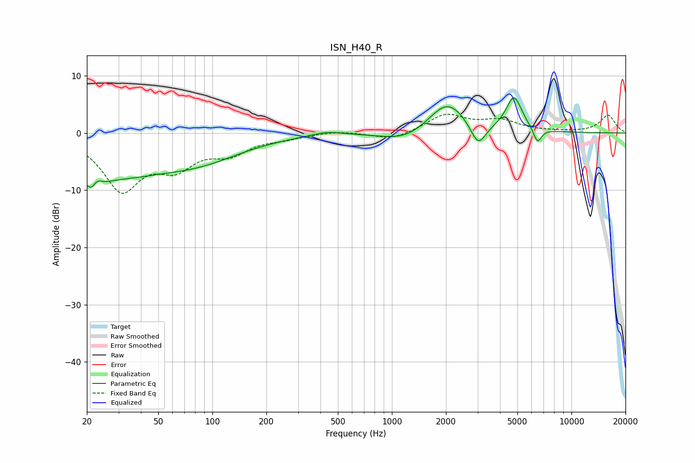

# ISN_H40_R
See [usage instructions](https://github.com/jaakkopasanen/AutoEq#usage) for more options and info.

### Parametric EQs
Apply preamp of -6.2 dB when using parametric equalizer.

|   # | Type    |   Fc (Hz) |    Q |   Gain (dB) |
|-----|---------|-----------|------|-------------|
|   1 | Peaking |        22 | 2.94 |        -6.5 |
|   2 | Peaking |        23 | 4.46 |         3.8 |
|   3 | Peaking |        29 | 0.55 |        -5.9 |
|   4 | Peaking |        84 | 0.56 |        -4   |
|   5 | Peaking |       434 | 1.7  |         0.7 |
|   6 | Peaking |      1208 | 1.06 |        -2   |
|   7 | Peaking |      2034 | 1.3  |         5.8 |
|   8 | Peaking |      3021 | 3.25 |        -4.2 |
|   9 | Peaking |      4788 | 3.15 |         6   |
|  10 | Peaking |      6466 | 5.98 |        -2.7 |

### Fixed Band EQs
When using fixed band (also called graphic) equalizer, apply preamp of **-3.4 dB** (if available) and set gains manually with these parameters.

|   # | Type    |   Fc (Hz) |    Q |   Gain (dB) |
|-----|---------|-----------|------|-------------|
|   1 | Peaking |        31 | 1.41 |        -9.5 |
|   2 | Peaking |        62 | 1.41 |        -4.9 |
|   3 | Peaking |       125 | 1.41 |        -3   |
|   4 | Peaking |       250 | 1.41 |        -0.7 |
|   5 | Peaking |       500 | 1.41 |         0.4 |
|   6 | Peaking |      1000 | 1.41 |        -1.3 |
|   7 | Peaking |      2000 | 1.41 |         3.1 |
|   8 | Peaking |      4000 | 1.41 |         2   |
|   9 | Peaking |      8000 | 1.41 |         0.1 |
|  10 | Peaking |     16000 | 1.41 |         3.1 |

### Graphs

