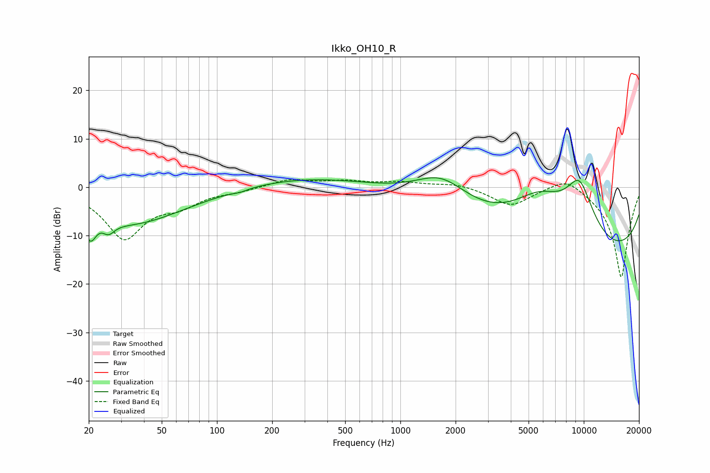

# Ikko_OH10_R
See [usage instructions](https://github.com/jaakkopasanen/AutoEq#usage) for more options and info.

### Parametric EQs
Apply preamp of -2.0 dB when using parametric equalizer.

|   # | Type    |   Fc (Hz) |    Q |   Gain (dB) |
|-----|---------|-----------|------|-------------|
|   1 | Peaking |        20 | 4.43 |        -5.1 |
|   2 | Peaking |        24 | 3.23 |         1.1 |
|   3 | Peaking |        25 | 4.11 |        -2.9 |
|   4 | Peaking |        34 | 0.48 |        -7.5 |
|   5 | Peaking |       134 | 3.7  |        -0.4 |
|   6 | Peaking |       533 | 0.27 |         2.9 |
|   7 | Peaking |      1673 | 0.91 |         6.9 |
|   8 | Peaking |      5715 | 0.65 |        13.1 |
|   9 | Peaking |      8351 | 0.18 |       -19.8 |
|  10 | Peaking |      9467 | 1.32 |        13.2 |

### Fixed Band EQs
When using fixed band (also called graphic) equalizer, apply preamp of **-1.7 dB** (if available) and set gains manually with these parameters.

|   # | Type    |   Fc (Hz) |    Q |   Gain (dB) |
|-----|---------|-----------|------|-------------|
|   1 | Peaking |        31 | 1.41 |       -10.3 |
|   2 | Peaking |        62 | 1.41 |        -2.9 |
|   3 | Peaking |       125 | 1.41 |        -0.7 |
|   4 | Peaking |       250 | 1.41 |         1.6 |
|   5 | Peaking |       500 | 1.41 |         1.1 |
|   6 | Peaking |      1000 | 1.41 |         1   |
|   7 | Peaking |      2000 | 1.41 |         0.8 |
|   8 | Peaking |      4000 | 1.41 |        -3.8 |
|   9 | Peaking |      8000 | 1.41 |         2.8 |
|  10 | Peaking |     16000 | 1.41 |       -18.8 |

### Graphs

