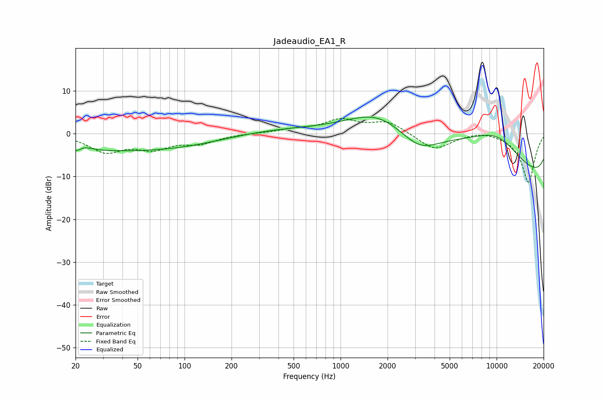

# Jadeaudio_EA1_R
See [usage instructions](https://github.com/jaakkopasanen/AutoEq#usage) for more options and info.

### Parametric EQs
Apply preamp of -4.0 dB when using parametric equalizer.

|   # | Type    |   Fc (Hz) |    Q |   Gain (dB) |
|-----|---------|-----------|------|-------------|
|   1 | Peaking |        21 | 3.07 |        -2.6 |
|   2 | Peaking |        22 | 2.96 |         2.7 |
|   3 | Peaking |        36 | 0.23 |        -3.9 |
|   4 | Peaking |       117 | 0.51 |        -0.4 |
|   5 | Peaking |       376 | 0.44 |         1.1 |
|   6 | Peaking |      1727 | 0.74 |         4.9 |
|   7 | Peaking |      3189 | 1.11 |        -4.6 |
|   8 | Peaking |      4397 | 0.26 |         9   |
|   9 | Peaking |     10000 | 0.19 |       -20   |
|  10 | Peaking |     10000 | 0.5  |        12.8 |

### Fixed Band EQs
When using fixed band (also called graphic) equalizer, apply preamp of **-3.6 dB** (if available) and set gains manually with these parameters.

|   # | Type    |   Fc (Hz) |    Q |   Gain (dB) |
|-----|---------|-----------|------|-------------|
|   1 | Peaking |        31 | 1.41 |        -4   |
|   2 | Peaking |        62 | 1.41 |        -3.1 |
|   3 | Peaking |       125 | 1.41 |        -2   |
|   4 | Peaking |       250 | 1.41 |         0.1 |
|   5 | Peaking |       500 | 1.41 |         0.8 |
|   6 | Peaking |      1000 | 1.41 |         3   |
|   7 | Peaking |      2000 | 1.41 |         2.8 |
|   8 | Peaking |      4000 | 1.41 |        -3.8 |
|   9 | Peaking |      8000 | 1.41 |         0.8 |
|  10 | Peaking |     16000 | 1.41 |       -11.4 |

### Graphs

