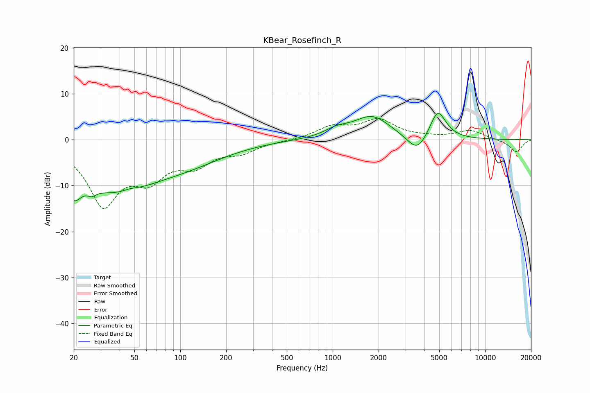

# KBear_Rosefinch_R
See [usage instructions](https://github.com/jaakkopasanen/AutoEq#usage) for more options and info.

### Parametric EQs
Apply preamp of -5.8 dB when using parametric equalizer.

|   # | Type    |   Fc (Hz) |    Q |   Gain (dB) |
|-----|---------|-----------|------|-------------|
|   1 | Peaking |        20 | 4.44 |       -12.3 |
|   2 | Peaking |        20 | 6    |         7.1 |
|   3 | Peaking |        26 | 5.24 |        -1.2 |
|   4 | Peaking |        37 | 0.45 |       -10.5 |
|   5 | Peaking |        47 | 3.01 |         0.5 |
|   6 | Peaking |       119 | 0.55 |        -2.7 |
|   7 | Peaking |      1060 | 1.73 |         1.5 |
|   8 | Peaking |      1814 | 1.18 |         5   |
|   9 | Peaking |      3592 | 2.13 |        -4.1 |
|  10 | Peaking |      4891 | 2.6  |         6.5 |

### Fixed Band EQs
When using fixed band (also called graphic) equalizer, apply preamp of **-4.7 dB** (if available) and set gains manually with these parameters.

|   # | Type    |   Fc (Hz) |    Q |   Gain (dB) |
|-----|---------|-----------|------|-------------|
|   1 | Peaking |        31 | 1.41 |       -13.6 |
|   2 | Peaking |        62 | 1.41 |        -6.6 |
|   3 | Peaking |       125 | 1.41 |        -4.5 |
|   4 | Peaking |       250 | 1.41 |        -2.3 |
|   5 | Peaking |       500 | 1.41 |        -0.1 |
|   6 | Peaking |      1000 | 1.41 |         2.6 |
|   7 | Peaking |      2000 | 1.41 |         4.1 |
|   8 | Peaking |      4000 | 1.41 |         0.3 |
|   9 | Peaking |      8000 | 1.41 |         2   |
|  10 | Peaking |     16000 | 1.41 |        -2.7 |

### Graphs

