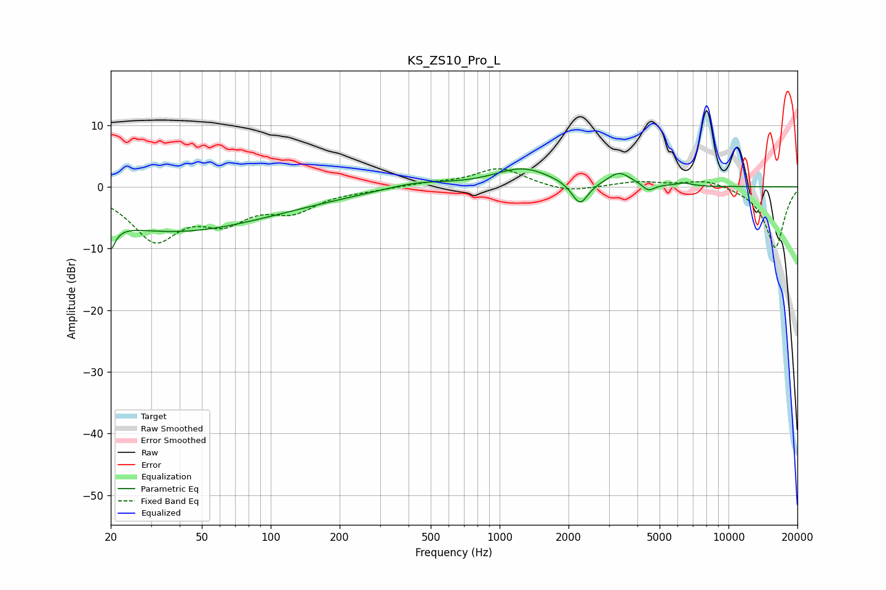

# KS_ZS10_Pro_L
See [usage instructions](https://github.com/jaakkopasanen/AutoEq#usage) for more options and info.

### Parametric EQs
Apply preamp of -3.0 dB when using parametric equalizer.

|   # | Type    |   Fc (Hz) |    Q |   Gain (dB) |
|-----|---------|-----------|------|-------------|
|   1 | Peaking |        20 | 5.93 |        -7.6 |
|   2 | Peaking |        20 | 5.88 |         3.3 |
|   3 | Peaking |        33 | 0.37 |        -6.3 |
|   4 | Peaking |        98 | 0.38 |        -1.6 |
|   5 | Peaking |       430 | 1.03 |         1   |
|   6 | Peaking |      1261 | 1.15 |         3   |
|   7 | Peaking |      2243 | 3.98 |        -3.8 |
|   8 | Peaking |      3333 | 2.81 |         2.2 |
|   9 | Peaking |      4469 | 5.64 |        -1.1 |
|  10 | Peaking |      6374 | 3.96 |         0.5 |

### Fixed Band EQs
When using fixed band (also called graphic) equalizer, apply preamp of **-3.0 dB** (if available) and set gains manually with these parameters.

|   # | Type    |   Fc (Hz) |    Q |   Gain (dB) |
|-----|---------|-----------|------|-------------|
|   1 | Peaking |        31 | 1.41 |        -8.1 |
|   2 | Peaking |        62 | 1.41 |        -4.5 |
|   3 | Peaking |       125 | 1.41 |        -3.4 |
|   4 | Peaking |       250 | 1.41 |        -0.4 |
|   5 | Peaking |       500 | 1.41 |         0.5 |
|   6 | Peaking |      1000 | 1.41 |         3   |
|   7 | Peaking |      2000 | 1.41 |        -1   |
|   8 | Peaking |      4000 | 1.41 |         0.8 |
|   9 | Peaking |      8000 | 1.41 |         1.2 |
|  10 | Peaking |     16000 | 1.41 |       -10   |

### Graphs

