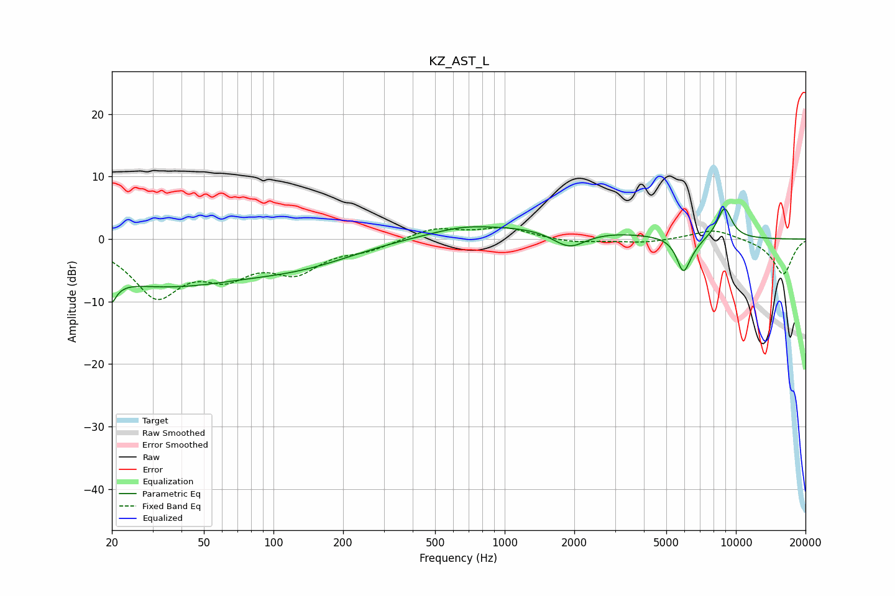

# KZ_AST_L
See [usage instructions](https://github.com/jaakkopasanen/AutoEq#usage) for more options and info.

### Parametric EQs
Apply preamp of -4.9 dB when using parametric equalizer.

|   # | Type    |   Fc (Hz) |    Q |   Gain (dB) |
|-----|---------|-----------|------|-------------|
|   1 | Peaking |        20 | 5.39 |        -7.3 |
|   2 | Peaking |        20 | 5.57 |         3.5 |
|   3 | Peaking |        32 | 0.38 |        -7   |
|   4 | Peaking |       136 | 0.57 |        -2.8 |
|   5 | Peaking |       656 | 1.29 |         0.7 |
|   6 | Peaking |      1211 | 0.34 |         2.2 |
|   7 | Peaking |      1902 | 1.9  |        -3   |
|   8 | Peaking |      5922 | 4.85 |        -5   |
|   9 | Peaking |      6455 | 2.91 |        -1.1 |
|  10 | Peaking |      8921 | 3.9  |         5   |

### Fixed Band EQs
When using fixed band (also called graphic) equalizer, apply preamp of **-1.9 dB** (if available) and set gains manually with these parameters.

|   # | Type    |   Fc (Hz) |    Q |   Gain (dB) |
|-----|---------|-----------|------|-------------|
|   1 | Peaking |        31 | 1.41 |        -8.6 |
|   2 | Peaking |        62 | 1.41 |        -4.6 |
|   3 | Peaking |       125 | 1.41 |        -4.6 |
|   4 | Peaking |       250 | 1.41 |        -1.4 |
|   5 | Peaking |       500 | 1.41 |         1.8 |
|   6 | Peaking |      1000 | 1.41 |         1.7 |
|   7 | Peaking |      2000 | 1.41 |        -0.6 |
|   8 | Peaking |      4000 | 1.41 |        -0.6 |
|   9 | Peaking |      8000 | 1.41 |         1.7 |
|  10 | Peaking |     16000 | 1.41 |        -5.7 |

### Graphs

