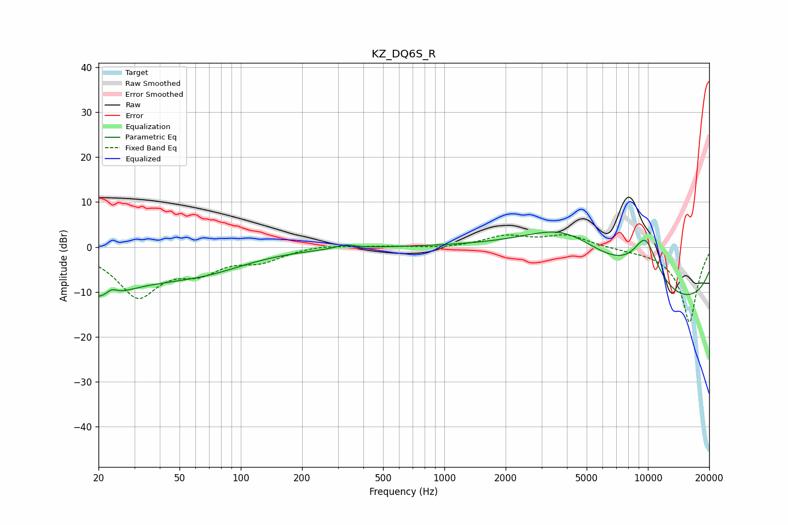

# KZ_DQ6S_R
See [usage instructions](https://github.com/jaakkopasanen/AutoEq#usage) for more options and info.

### Parametric EQs
Apply preamp of -3.4 dB when using parametric equalizer.

|   # | Type    |   Fc (Hz) |    Q |   Gain (dB) |
|-----|---------|-----------|------|-------------|
|   1 | Peaking |        21 | 1.66 |        -0.7 |
|   2 | Peaking |        21 | 4.54 |         2.1 |
|   3 | Peaking |        22 | 2.59 |        -8   |
|   4 | Peaking |        23 | 3.86 |         4.6 |
|   5 | Peaking |        24 | 0.39 |        -7.1 |
|   6 | Peaking |        70 | 0.69 |        -2.6 |
|   7 | Peaking |       327 | 3.14 |         0.9 |
|   8 | Peaking |      3898 | 0.48 |        14.1 |
|   9 | Peaking |      9724 | 1.78 |        10.9 |
|  10 | Peaking |     10000 | 0.18 |       -15.3 |

### Fixed Band EQs
When using fixed band (also called graphic) equalizer, apply preamp of **-2.8 dB** (if available) and set gains manually with these parameters.

|   # | Type    |   Fc (Hz) |    Q |   Gain (dB) |
|-----|---------|-----------|------|-------------|
|   1 | Peaking |        31 | 1.41 |       -10.6 |
|   2 | Peaking |        62 | 1.41 |        -4.3 |
|   3 | Peaking |       125 | 1.41 |        -2.7 |
|   4 | Peaking |       250 | 1.41 |         0.6 |
|   5 | Peaking |       500 | 1.41 |         0.2 |
|   6 | Peaking |      1000 | 1.41 |        -0.3 |
|   7 | Peaking |      2000 | 1.41 |         2.3 |
|   8 | Peaking |      4000 | 1.41 |         2.6 |
|   9 | Peaking |      8000 | 1.41 |        -0.3 |
|  10 | Peaking |     16000 | 1.41 |       -16.9 |

### Graphs

