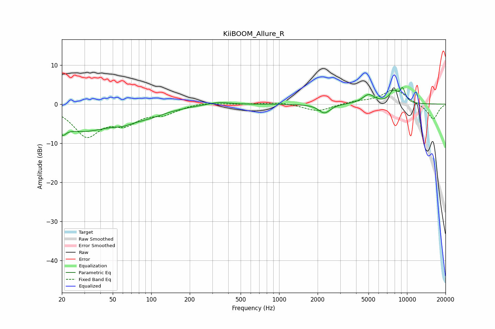

# KiiBOOM_Allure_R
See [usage instructions](https://github.com/jaakkopasanen/AutoEq#usage) for more options and info.

### Parametric EQs
Apply preamp of -4.3 dB when using parametric equalizer.

|   # | Type    |   Fc (Hz) |    Q |   Gain (dB) |
|-----|---------|-----------|------|-------------|
|   1 | Peaking |        21 | 4.95 |        -6.1 |
|   2 | Peaking |        21 | 5.28 |         3.6 |
|   3 | Peaking |        29 | 0.59 |        -6.4 |
|   4 | Peaking |        60 | 1.86 |        -1   |
|   5 | Peaking |        92 | 0.89 |        -2   |
|   6 | Peaking |       334 | 1.7  |         0.7 |
|   7 | Peaking |      2263 | 3.14 |        -2.3 |
|   8 | Peaking |      5010 | 2.9  |         2.3 |
|   9 | Peaking |      7837 | 4.08 |         2.9 |
|  10 | Peaking |      9236 | 5.63 |         3.4 |

### Fixed Band EQs
When using fixed band (also called graphic) equalizer, apply preamp of **-3.8 dB** (if available) and set gains manually with these parameters.

|   # | Type    |   Fc (Hz) |    Q |   Gain (dB) |
|-----|---------|-----------|------|-------------|
|   1 | Peaking |        31 | 1.41 |        -7.7 |
|   2 | Peaking |        62 | 1.41 |        -4.1 |
|   3 | Peaking |       125 | 1.41 |        -2.1 |
|   4 | Peaking |       250 | 1.41 |         0.5 |
|   5 | Peaking |       500 | 1.41 |         0   |
|   6 | Peaking |      1000 | 1.41 |         0.5 |
|   7 | Peaking |      2000 | 1.41 |        -1.9 |
|   8 | Peaking |      4000 | 1.41 |         0.6 |
|   9 | Peaking |      8000 | 1.41 |         3.8 |
|  10 | Peaking |     16000 | 1.41 |        -4   |

### Graphs

