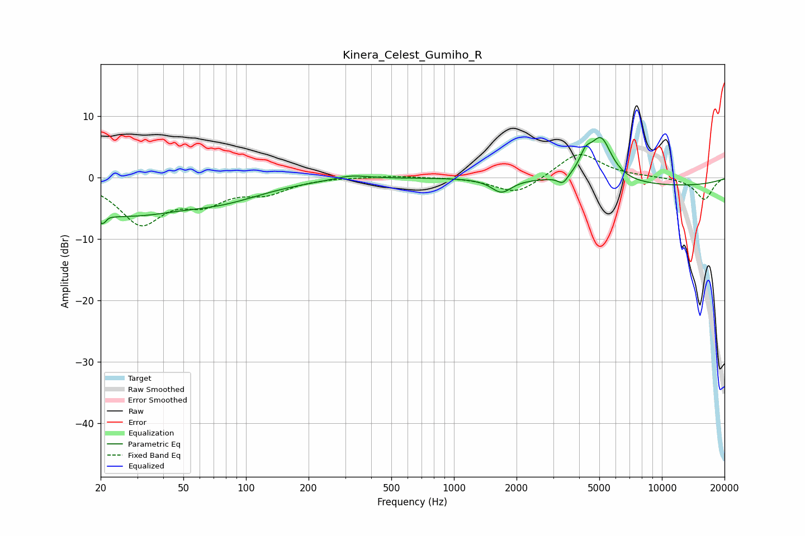

# Kinera_Celest_Gumiho_R
See [usage instructions](https://github.com/jaakkopasanen/AutoEq#usage) for more options and info.

### Parametric EQs
Apply preamp of -6.6 dB when using parametric equalizer.

|   # | Type    |   Fc (Hz) |    Q |   Gain (dB) |
|-----|---------|-----------|------|-------------|
|   1 | Peaking |        21 | 4.99 |        -4.8 |
|   2 | Peaking |        21 | 5.63 |         3   |
|   3 | Peaking |        26 | 0.55 |        -5.4 |
|   4 | Peaking |        77 | 0.66 |        -2.7 |
|   5 | Peaking |       321 | 1.81 |         0.7 |
|   6 | Peaking |      1693 | 2.92 |        -2.2 |
|   7 | Peaking |      3343 | 6    |        -1.4 |
|   8 | Peaking |      4292 | 4.83 |         2.6 |
|   9 | Peaking |      5093 | 2.62 |         7   |
|  10 | Peaking |     10000 | 0.28 |        -1.4 |

### Fixed Band EQs
When using fixed band (also called graphic) equalizer, apply preamp of **-3.8 dB** (if available) and set gains manually with these parameters.

|   # | Type    |   Fc (Hz) |    Q |   Gain (dB) |
|-----|---------|-----------|------|-------------|
|   1 | Peaking |        31 | 1.41 |        -7.2 |
|   2 | Peaking |        62 | 1.41 |        -3.4 |
|   3 | Peaking |       125 | 1.41 |        -2.2 |
|   4 | Peaking |       250 | 1.41 |         0.1 |
|   5 | Peaking |       500 | 1.41 |         0.3 |
|   6 | Peaking |      1000 | 1.41 |         0.1 |
|   7 | Peaking |      2000 | 1.41 |        -2.8 |
|   8 | Peaking |      4000 | 1.41 |         4.2 |
|   9 | Peaking |      8000 | 1.41 |         0.1 |
|  10 | Peaking |     16000 | 1.41 |        -3.6 |

### Graphs

