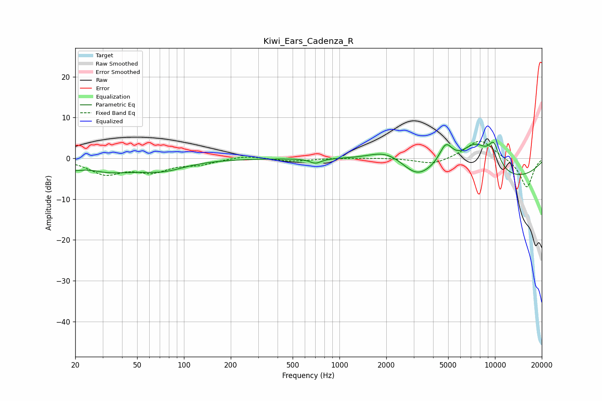

# Kiwi_Ears_Cadenza_R
See [usage instructions](https://github.com/jaakkopasanen/AutoEq#usage) for more options and info.

### Parametric EQs
Apply preamp of -4.0 dB when using parametric equalizer.

|   # | Type    |   Fc (Hz) |    Q |   Gain (dB) |
|-----|---------|-----------|------|-------------|
|   1 | Peaking |        24 | 1.83 |         1.2 |
|   2 | Peaking |        25 | 0.52 |        -3.9 |
|   3 | Peaking |        75 | 1.03 |        -1.9 |
|   4 | Peaking |       701 | 3.95 |        -1.2 |
|   5 | Peaking |      2009 | 1.22 |         2.9 |
|   6 | Peaking |      3141 | 1.58 |        -3.3 |
|   7 | Peaking |      4828 | 3.16 |         5.2 |
|   8 | Peaking |      7475 | 1.27 |         7.9 |
|   9 | Peaking |      9837 | 3.4  |         5.4 |
|  10 | Peaking |     10000 | 0.3  |        -5.9 |

### Fixed Band EQs
When using fixed band (also called graphic) equalizer, apply preamp of **-4.3 dB** (if available) and set gains manually with these parameters.

|   # | Type    |   Fc (Hz) |    Q |   Gain (dB) |
|-----|---------|-----------|------|-------------|
|   1 | Peaking |        31 | 1.41 |        -3.6 |
|   2 | Peaking |        62 | 1.41 |        -2.9 |
|   3 | Peaking |       125 | 1.41 |        -1.3 |
|   4 | Peaking |       250 | 1.41 |         0.7 |
|   5 | Peaking |       500 | 1.41 |        -0.7 |
|   6 | Peaking |      1000 | 1.41 |         0.1 |
|   7 | Peaking |      2000 | 1.41 |         0.1 |
|   8 | Peaking |      4000 | 1.41 |        -1.7 |
|   9 | Peaking |      8000 | 1.41 |         4.8 |
|  10 | Peaking |     16000 | 1.41 |        -7.3 |

### Graphs

