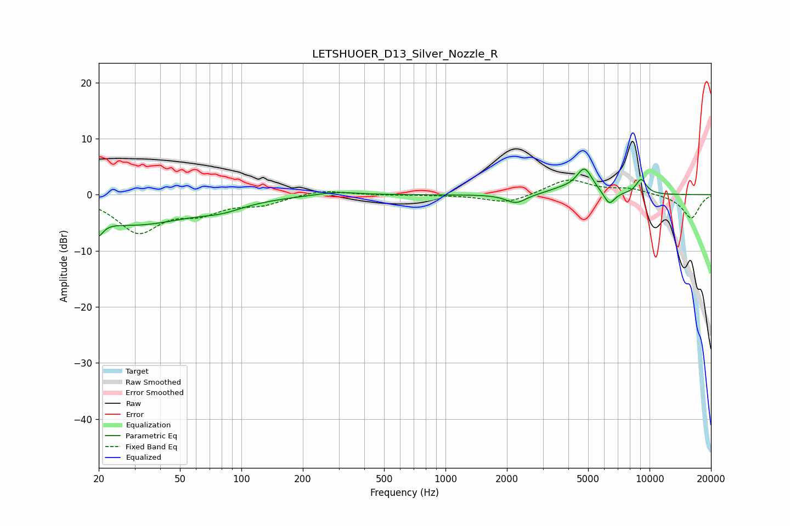

# LETSHUOER_D13_Silver_Nozzle_R
See [usage instructions](https://github.com/jaakkopasanen/AutoEq#usage) for more options and info.

### Parametric EQs
Apply preamp of -4.6 dB when using parametric equalizer.

|   # | Type    |   Fc (Hz) |    Q |   Gain (dB) |
|-----|---------|-----------|------|-------------|
|   1 | Peaking |        20 | 5.89 |        -5.8 |
|   2 | Peaking |        20 | 5.98 |         3   |
|   3 | Peaking |        29 | 0.49 |        -5.2 |
|   4 | Peaking |        81 | 1.35 |        -1.2 |
|   5 | Peaking |       290 | 1.43 |         0.7 |
|   6 | Peaking |      2216 | 2.9  |        -1.6 |
|   7 | Peaking |      3714 | 1.95 |         0.8 |
|   8 | Peaking |      4799 | 3.51 |         4.4 |
|   9 | Peaking |      6347 | 5.08 |        -2.4 |
|  10 | Peaking |      9093 | 4.85 |         2.7 |

### Fixed Band EQs
When using fixed band (also called graphic) equalizer, apply preamp of **-2.7 dB** (if available) and set gains manually with these parameters.

|   # | Type    |   Fc (Hz) |    Q |   Gain (dB) |
|-----|---------|-----------|------|-------------|
|   1 | Peaking |        31 | 1.41 |        -6.4 |
|   2 | Peaking |        62 | 1.41 |        -2.7 |
|   3 | Peaking |       125 | 1.41 |        -1.5 |
|   4 | Peaking |       250 | 1.41 |         1   |
|   5 | Peaking |       500 | 1.41 |        -0.1 |
|   6 | Peaking |      1000 | 1.41 |        -0   |
|   7 | Peaking |      2000 | 1.41 |        -1.6 |
|   8 | Peaking |      4000 | 1.41 |         2.8 |
|   9 | Peaking |      8000 | 1.41 |         1   |
|  10 | Peaking |     16000 | 1.41 |        -4.2 |

### Graphs

