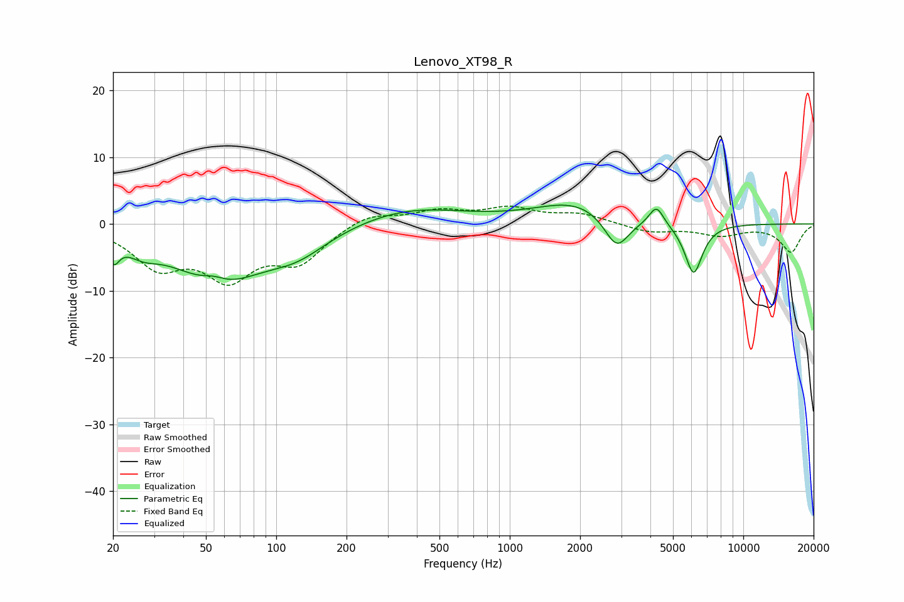

# Lenovo_XT98_R
See [usage instructions](https://github.com/jaakkopasanen/AutoEq#usage) for more options and info.

### Parametric EQs
Apply preamp of -2.9 dB when using parametric equalizer.

|   # | Type    |   Fc (Hz) |    Q |   Gain (dB) |
|-----|---------|-----------|------|-------------|
|   1 | Peaking |        20 | 5.97 |        -3.1 |
|   2 | Peaking |        27 | 2.09 |        -1.8 |
|   3 | Peaking |        54 | 2.63 |         1.2 |
|   4 | Peaking |        56 | 0.71 |        -8.5 |
|   5 | Peaking |       123 | 1.06 |        -3   |
|   6 | Peaking |       371 | 0.6  |         2.5 |
|   7 | Peaking |      1949 | 0.8  |         3.3 |
|   8 | Peaking |      2869 | 2.57 |        -5.2 |
|   9 | Peaking |      4248 | 4.54 |         2.9 |
|  10 | Peaking |      6127 | 3.57 |        -7.7 |

### Fixed Band EQs
When using fixed band (also called graphic) equalizer, apply preamp of **-2.8 dB** (if available) and set gains manually with these parameters.

|   # | Type    |   Fc (Hz) |    Q |   Gain (dB) |
|-----|---------|-----------|------|-------------|
|   1 | Peaking |        31 | 1.41 |        -5.8 |
|   2 | Peaking |        62 | 1.41 |        -7.2 |
|   3 | Peaking |       125 | 1.41 |        -5.1 |
|   4 | Peaking |       250 | 1.41 |         1.8 |
|   5 | Peaking |       500 | 1.41 |         1.8 |
|   6 | Peaking |      1000 | 1.41 |         2.1 |
|   7 | Peaking |      2000 | 1.41 |         1.4 |
|   8 | Peaking |      4000 | 1.41 |        -1.2 |
|   9 | Peaking |      8000 | 1.41 |        -1.6 |
|  10 | Peaking |     16000 | 1.41 |        -4.2 |

### Graphs

