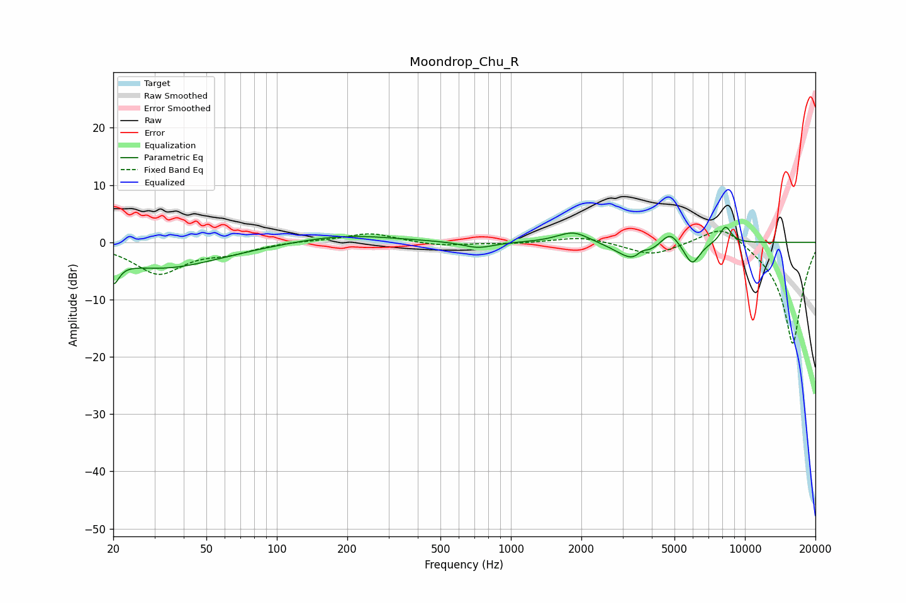

# Moondrop_Chu_R
See [usage instructions](https://github.com/jaakkopasanen/AutoEq#usage) for more options and info.

### Parametric EQs
Apply preamp of -2.7 dB when using parametric equalizer.

|   # | Type    |   Fc (Hz) |    Q |   Gain (dB) |
|-----|---------|-----------|------|-------------|
|   1 | Peaking |        20 | 5.89 |        -4   |
|   2 | Peaking |        32 | 0.57 |        -4.5 |
|   3 | Peaking |       195 | 0.69 |         1.4 |
|   4 | Peaking |       724 | 2.11 |        -1.1 |
|   5 | Peaking |      1849 | 2.06 |         2   |
|   6 | Peaking |      3391 | 1.96 |        -3.5 |
|   7 | Peaking |      3635 | 5.98 |         1.1 |
|   8 | Peaking |      4781 | 3.56 |         2.7 |
|   9 | Peaking |      5946 | 4.16 |        -3.9 |
|  10 | Peaking |      8260 | 5.26 |         3   |

### Fixed Band EQs
When using fixed band (also called graphic) equalizer, apply preamp of **-2.0 dB** (if available) and set gains manually with these parameters.

|   # | Type    |   Fc (Hz) |    Q |   Gain (dB) |
|-----|---------|-----------|------|-------------|
|   1 | Peaking |        31 | 1.41 |        -5.3 |
|   2 | Peaking |        62 | 1.41 |        -1.5 |
|   3 | Peaking |       125 | 1.41 |         0.2 |
|   4 | Peaking |       250 | 1.41 |         1.6 |
|   5 | Peaking |       500 | 1.41 |        -0.7 |
|   6 | Peaking |      1000 | 1.41 |        -0.2 |
|   7 | Peaking |      2000 | 1.41 |         1.1 |
|   8 | Peaking |      4000 | 1.41 |        -2.3 |
|   9 | Peaking |      8000 | 1.41 |         3.7 |
|  10 | Peaking |     16000 | 1.41 |       -18   |

### Graphs

