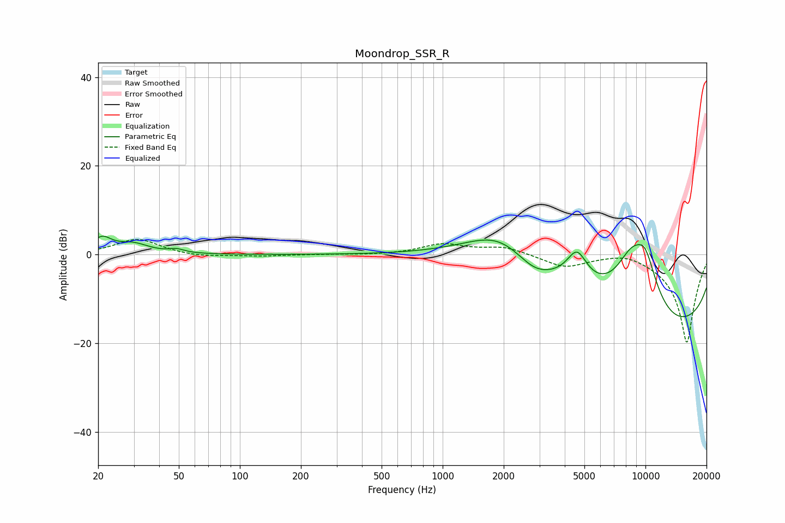

# Moondrop_SSR_R
See [usage instructions](https://github.com/jaakkopasanen/AutoEq#usage) for more options and info.

### Parametric EQs
Apply preamp of -4.3 dB when using parametric equalizer.

|   # | Type    |   Fc (Hz) |    Q |   Gain (dB) |
|-----|---------|-----------|------|-------------|
|   1 | Peaking |        21 | 3.05 |         3.3 |
|   2 | Peaking |        30 | 1.8  |         2.2 |
|   3 | Peaking |        49 | 3.96 |         0.8 |
|   4 | Peaking |      1904 | 0.85 |         6.3 |
|   5 | Peaking |      2399 | 0.38 |         6.1 |
|   6 | Peaking |      2817 | 1.64 |        -2.8 |
|   7 | Peaking |      4595 | 2.61 |         7.4 |
|   8 | Peaking |      8484 | 1.26 |        12.5 |
|   9 | Peaking |      9951 | 0.18 |       -20   |
|  10 | Peaking |      9966 | 1.89 |        10.2 |

### Fixed Band EQs
When using fixed band (also called graphic) equalizer, apply preamp of **-3.5 dB** (if available) and set gains manually with these parameters.

|   # | Type    |   Fc (Hz) |    Q |   Gain (dB) |
|-----|---------|-----------|------|-------------|
|   1 | Peaking |        31 | 1.41 |         3.5 |
|   2 | Peaking |        62 | 1.41 |        -0.6 |
|   3 | Peaking |       125 | 1.41 |        -0.3 |
|   4 | Peaking |       250 | 1.41 |         0   |
|   5 | Peaking |       500 | 1.41 |        -0.1 |
|   6 | Peaking |      1000 | 1.41 |         2.3 |
|   7 | Peaking |      2000 | 1.41 |         1.7 |
|   8 | Peaking |      4000 | 1.41 |        -2.8 |
|   9 | Peaking |      8000 | 1.41 |         1.2 |
|  10 | Peaking |     16000 | 1.41 |       -20   |

### Graphs

