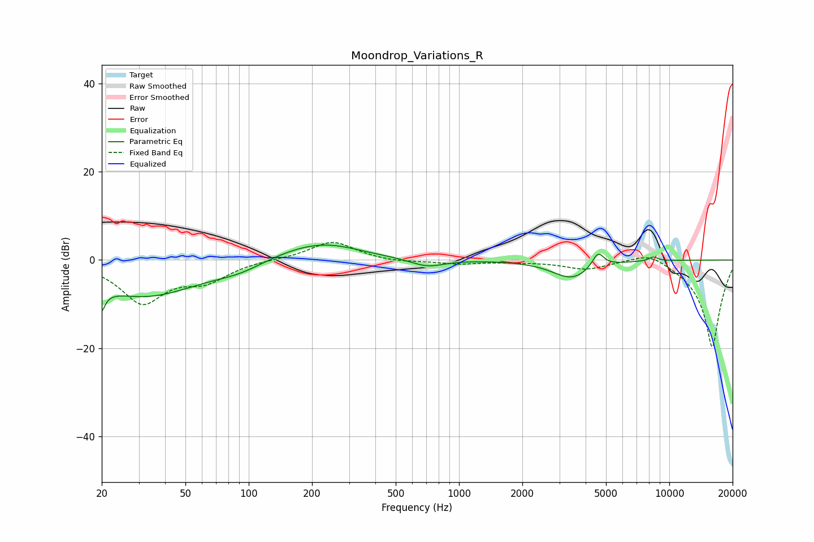

# Moondrop_Variations_R
See [usage instructions](https://github.com/jaakkopasanen/AutoEq#usage) for more options and info.

### Parametric EQs
Apply preamp of -3.5 dB when using parametric equalizer.

|   # | Type    |   Fc (Hz) |    Q |   Gain (dB) |
|-----|---------|-----------|------|-------------|
|   1 | Peaking |        20 | 5.95 |        -8.3 |
|   2 | Peaking |        20 | 5.94 |         3.2 |
|   3 | Peaking |        32 | 0.53 |        -8.2 |
|   4 | Peaking |        91 | 1.22 |        -1.5 |
|   5 | Peaking |       191 | 0.71 |         3.4 |
|   6 | Peaking |       256 | 1.04 |         1.1 |
|   7 | Peaking |       707 | 1.78 |        -1.8 |
|   8 | Peaking |      3439 | 1.51 |        -4.2 |
|   9 | Peaking |      4582 | 5    |         3.5 |
|  10 | Peaking |      8404 | 6    |         0.9 |

### Fixed Band EQs
When using fixed band (also called graphic) equalizer, apply preamp of **-4.1 dB** (if available) and set gains manually with these parameters.

|   # | Type    |   Fc (Hz) |    Q |   Gain (dB) |
|-----|---------|-----------|------|-------------|
|   1 | Peaking |        31 | 1.41 |        -9.4 |
|   2 | Peaking |        62 | 1.41 |        -4   |
|   3 | Peaking |       125 | 1.41 |         0.2 |
|   4 | Peaking |       250 | 1.41 |         4.3 |
|   5 | Peaking |       500 | 1.41 |        -0.5 |
|   6 | Peaking |      1000 | 1.41 |        -0.9 |
|   7 | Peaking |      2000 | 1.41 |        -0.3 |
|   8 | Peaking |      4000 | 1.41 |        -2   |
|   9 | Peaking |      8000 | 1.41 |         2.5 |
|  10 | Peaking |     16000 | 1.41 |       -20   |

### Graphs

