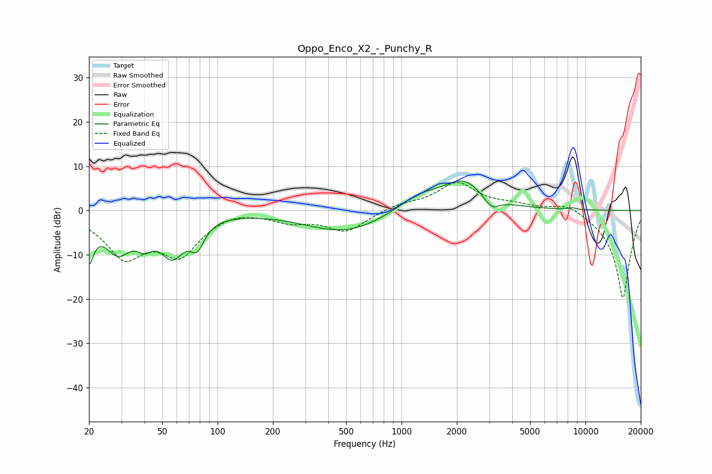

# Oppo_Enco_X2_-_Punchy_R
See [usage instructions](https://github.com/jaakkopasanen/AutoEq#usage) for more options and info.

### Parametric EQs
Apply preamp of -6.8 dB when using parametric equalizer.

|   # | Type    |   Fc (Hz) |    Q |   Gain (dB) |
|-----|---------|-----------|------|-------------|
|   1 | Peaking |        20 | 5.69 |        -8.6 |
|   2 | Peaking |        29 | 1.85 |        -8.3 |
|   3 | Peaking |        40 | 3.57 |        -3.2 |
|   4 | Peaking |        57 | 2.01 |        -8.7 |
|   5 | Peaking |        78 | 3.74 |        -5.1 |
|   6 | Peaking |       495 | 0.66 |        -5   |
|   7 | Peaking |      1245 | 1.19 |         3.3 |
|   8 | Peaking |      2177 | 1.21 |         6.5 |
|   9 | Peaking |      3082 | 3.37 |        -2.8 |
|  10 | Peaking |      8500 | 5.91 |         0.4 |

### Fixed Band EQs
When using fixed band (also called graphic) equalizer, apply preamp of **-6.4 dB** (if available) and set gains manually with these parameters.

|   # | Type    |   Fc (Hz) |    Q |   Gain (dB) |
|-----|---------|-----------|------|-------------|
|   1 | Peaking |        31 | 1.41 |        -9.7 |
|   2 | Peaking |        62 | 1.41 |        -9.1 |
|   3 | Peaking |       125 | 1.41 |         0.9 |
|   4 | Peaking |       250 | 1.41 |        -2.1 |
|   5 | Peaking |       500 | 1.41 |        -4.6 |
|   6 | Peaking |      1000 | 1.41 |         1.3 |
|   7 | Peaking |      2000 | 1.41 |         6.1 |
|   8 | Peaking |      4000 | 1.41 |         1.1 |
|   9 | Peaking |      8000 | 1.41 |         2.1 |
|  10 | Peaking |     16000 | 1.41 |       -20   |

### Graphs

