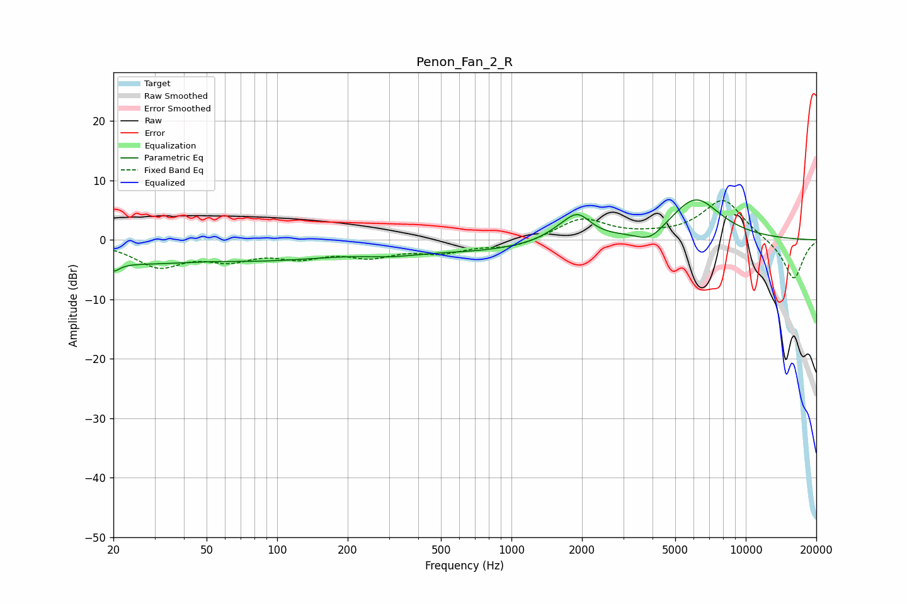

# Penon_Fan_2_R
See [usage instructions](https://github.com/jaakkopasanen/AutoEq#usage) for more options and info.

### Parametric EQs
Apply preamp of -6.8 dB when using parametric equalizer.

|   # | Type    |   Fc (Hz) |    Q |   Gain (dB) |
|-----|---------|-----------|------|-------------|
|   1 | Peaking |        20 | 5.97 |         3.2 |
|   2 | Peaking |        20 | 5.9  |        -4.5 |
|   3 | Peaking |        35 | 0.18 |        -4.2 |
|   4 | Peaking |        52 | 0.95 |         0.5 |
|   5 | Peaking |       310 | 1.19 |        -0.8 |
|   6 | Peaking |       711 | 0.52 |        -1.6 |
|   7 | Peaking |      1650 | 1.81 |         1.5 |
|   8 | Peaking |      1923 | 2.54 |         3.5 |
|   9 | Peaking |      3904 | 2.35 |        -2.2 |
|  10 | Peaking |      6099 | 1.26 |         7   |

### Fixed Band EQs
When using fixed band (also called graphic) equalizer, apply preamp of **-6.7 dB** (if available) and set gains manually with these parameters.

|   # | Type    |   Fc (Hz) |    Q |   Gain (dB) |
|-----|---------|-----------|------|-------------|
|   1 | Peaking |        31 | 1.41 |        -4.2 |
|   2 | Peaking |        62 | 1.41 |        -2.7 |
|   3 | Peaking |       125 | 1.41 |        -2.4 |
|   4 | Peaking |       250 | 1.41 |        -2.3 |
|   5 | Peaking |       500 | 1.41 |        -1.8 |
|   6 | Peaking |      1000 | 1.41 |        -1.3 |
|   7 | Peaking |      2000 | 1.41 |         3.6 |
|   8 | Peaking |      4000 | 1.41 |         0.4 |
|   9 | Peaking |      8000 | 1.41 |         6.8 |
|  10 | Peaking |     16000 | 1.41 |        -6.8 |

### Graphs

