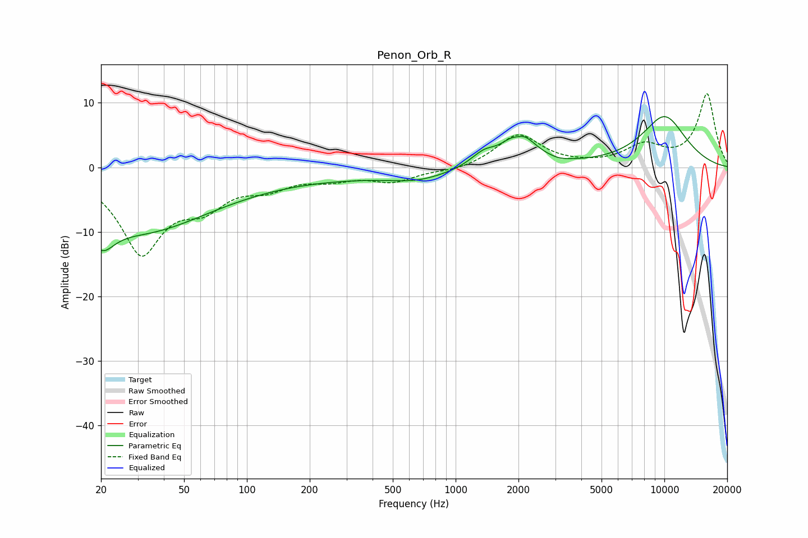

# Penon_Orb_R
See [usage instructions](https://github.com/jaakkopasanen/AutoEq#usage) for more options and info.

### Parametric EQs
Apply preamp of -8.0 dB when using parametric equalizer.

|   # | Type    |   Fc (Hz) |    Q |   Gain (dB) |
|-----|---------|-----------|------|-------------|
|   1 | Peaking |        20 | 2.3  |        -4.9 |
|   2 | Peaking |        31 | 0.44 |        -8.7 |
|   3 | Peaking |       150 | 0.18 |        -1.5 |
|   4 | Peaking |       659 | 1.06 |        -1.2 |
|   5 | Peaking |      1296 | 5.67 |        -0.1 |
|   6 | Peaking |      1351 | 2.4  |         2   |
|   7 | Peaking |      1987 | 4.43 |        -1   |
|   8 | Peaking |      2012 | 1.98 |         5.5 |
|   9 | Peaking |      3141 | 3.51 |        -0.2 |
|  10 | Peaking |     10000 | 1.07 |         7.8 |

### Fixed Band EQs
When using fixed band (also called graphic) equalizer, apply preamp of **-11.5 dB** (if available) and set gains manually with these parameters.

|   # | Type    |   Fc (Hz) |    Q |   Gain (dB) |
|-----|---------|-----------|------|-------------|
|   1 | Peaking |        31 | 1.41 |       -12.8 |
|   2 | Peaking |        62 | 1.41 |        -4.5 |
|   3 | Peaking |       125 | 1.41 |        -2.5 |
|   4 | Peaking |       250 | 1.41 |        -1.5 |
|   5 | Peaking |       500 | 1.41 |        -2   |
|   6 | Peaking |      1000 | 1.41 |        -0.6 |
|   7 | Peaking |      2000 | 1.41 |         5.1 |
|   8 | Peaking |      4000 | 1.41 |         0.1 |
|   9 | Peaking |      8000 | 1.41 |         3.1 |
|  10 | Peaking |     16000 | 1.41 |        11.3 |

### Graphs

