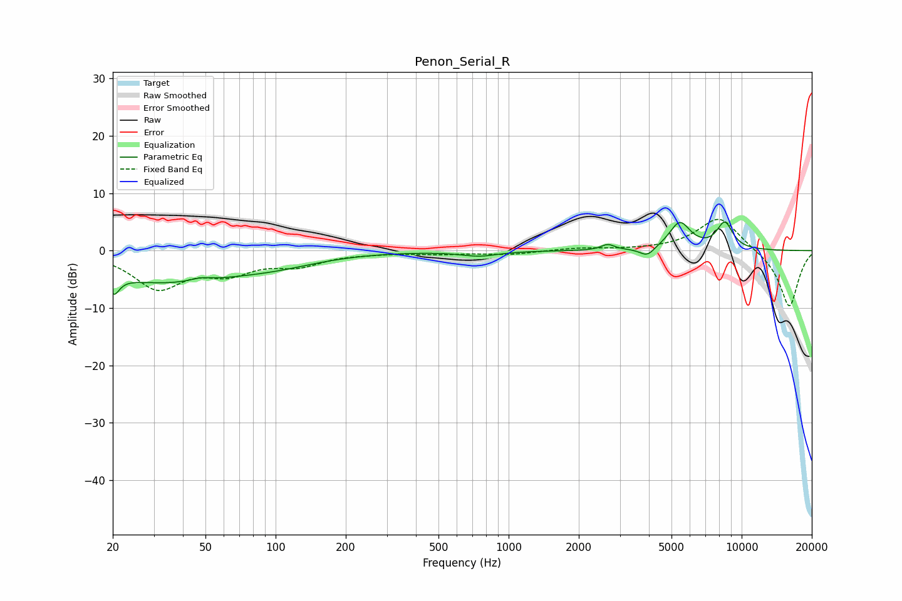

# Penon_Serial_R
See [usage instructions](https://github.com/jaakkopasanen/AutoEq#usage) for more options and info.

### Parametric EQs
Apply preamp of -5.1 dB when using parametric equalizer.

|   # | Type    |   Fc (Hz) |    Q |   Gain (dB) |
|-----|---------|-----------|------|-------------|
|   1 | Peaking |        20 | 5.75 |         2.8 |
|   2 | Peaking |        20 | 5.93 |        -5.9 |
|   3 | Peaking |        33 | 0.44 |        -5.3 |
|   4 | Peaking |        48 | 3.15 |         0.6 |
|   5 | Peaking |       101 | 0.74 |        -1.4 |
|   6 | Peaking |       748 | 1.79 |        -0.9 |
|   7 | Peaking |      2665 | 5.05 |         1   |
|   8 | Peaking |      3935 | 4.36 |        -1.6 |
|   9 | Peaking |      5427 | 3.02 |         4.8 |
|  10 | Peaking |      8463 | 3.74 |         4.6 |

### Fixed Band EQs
When using fixed band (also called graphic) equalizer, apply preamp of **-5.5 dB** (if available) and set gains manually with these parameters.

|   # | Type    |   Fc (Hz) |    Q |   Gain (dB) |
|-----|---------|-----------|------|-------------|
|   1 | Peaking |        31 | 1.41 |        -6.3 |
|   2 | Peaking |        62 | 1.41 |        -3.3 |
|   3 | Peaking |       125 | 1.41 |        -2.2 |
|   4 | Peaking |       250 | 1.41 |        -0.2 |
|   5 | Peaking |       500 | 1.41 |        -0.5 |
|   6 | Peaking |      1000 | 1.41 |        -0.6 |
|   7 | Peaking |      2000 | 1.41 |         0.4 |
|   8 | Peaking |      4000 | 1.41 |         0.1 |
|   9 | Peaking |      8000 | 1.41 |         6   |
|  10 | Peaking |     16000 | 1.41 |       -10   |

### Graphs

