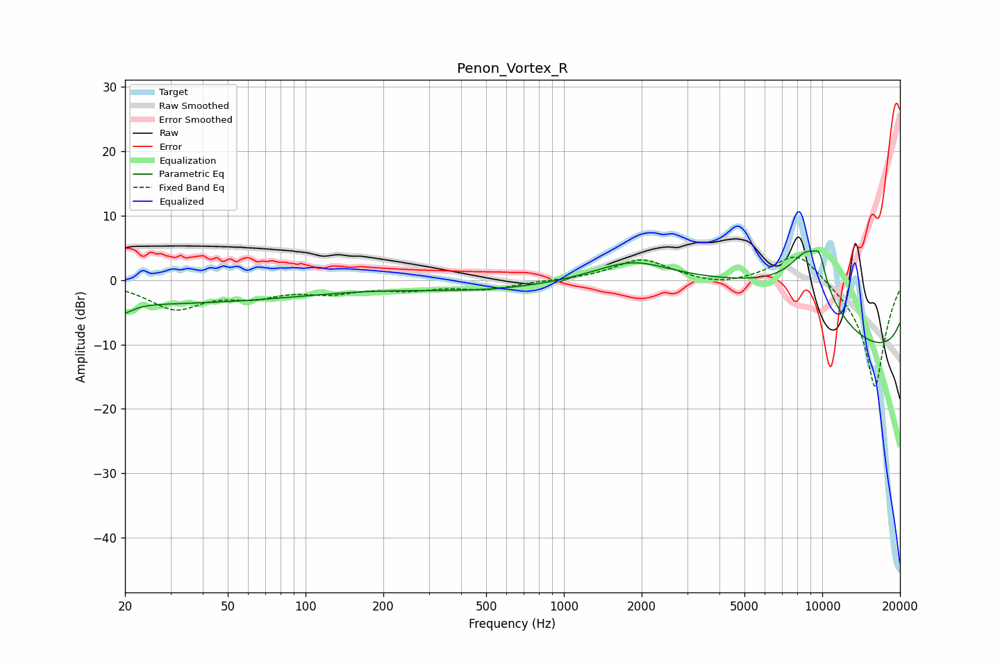

# Penon_Vortex_R
See [usage instructions](https://github.com/jaakkopasanen/AutoEq#usage) for more options and info.

### Parametric EQs
Apply preamp of -4.7 dB when using parametric equalizer.

|   # | Type    |   Fc (Hz) |    Q |   Gain (dB) |
|-----|---------|-----------|------|-------------|
|   1 | Peaking |        20 | 5.17 |        -4.2 |
|   2 | Peaking |        20 | 5.98 |         2.7 |
|   3 | Peaking |        24 | 0.2  |        -3.6 |
|   4 | Peaking |       580 | 0.43 |        -2.1 |
|   5 | Peaking |      1841 | 0.98 |         3.1 |
|   6 | Peaking |      2852 | 0.26 |         5.9 |
|   7 | Peaking |      7796 | 0.35 |        11.6 |
|   8 | Peaking |      8822 | 1.66 |         8.3 |
|   9 | Peaking |      9772 | 5.78 |         3.3 |
|  10 | Peaking |     10000 | 0.18 |       -19.9 |

### Fixed Band EQs
When using fixed band (also called graphic) equalizer, apply preamp of **-3.7 dB** (if available) and set gains manually with these parameters.

|   # | Type    |   Fc (Hz) |    Q |   Gain (dB) |
|-----|---------|-----------|------|-------------|
|   1 | Peaking |        31 | 1.41 |        -4.2 |
|   2 | Peaking |        62 | 1.41 |        -2   |
|   3 | Peaking |       125 | 1.41 |        -1.6 |
|   4 | Peaking |       250 | 1.41 |        -1.2 |
|   5 | Peaking |       500 | 1.41 |        -1.3 |
|   6 | Peaking |      1000 | 1.41 |        -0   |
|   7 | Peaking |      2000 | 1.41 |         3.3 |
|   8 | Peaking |      4000 | 1.41 |        -0.9 |
|   9 | Peaking |      8000 | 1.41 |         4.9 |
|  10 | Peaking |     16000 | 1.41 |       -16.9 |

### Graphs

