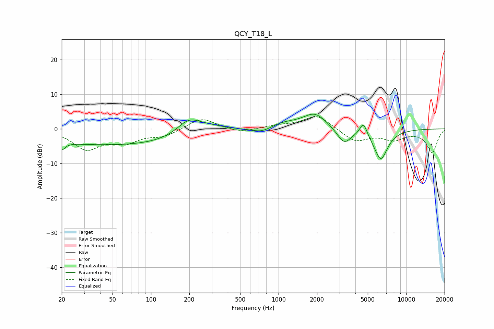

# QCY_T18_L
See [usage instructions](https://github.com/jaakkopasanen/AutoEq#usage) for more options and info.

### Parametric EQs
Apply preamp of -4.3 dB when using parametric equalizer.

|   # | Type    |   Fc (Hz) |    Q |   Gain (dB) |
|-----|---------|-----------|------|-------------|
|   1 | Peaking |        20 | 5.55 |        -2.2 |
|   2 | Peaking |        60 | 0.18 |        -4.8 |
|   3 | Peaking |       196 | 1.56 |         4   |
|   4 | Peaking |       272 | 0.85 |         2.7 |
|   5 | Peaking |       739 | 1.91 |        -1.4 |
|   6 | Peaking |      1096 | 1.33 |         1.5 |
|   7 | Peaking |      1924 | 1.5  |         4.5 |
|   8 | Peaking |      3264 | 2.5  |        -4.5 |
|   9 | Peaking |      4624 | 4.93 |         3.9 |
|  10 | Peaking |      6318 | 2.48 |        -8.8 |

### Fixed Band EQs
When using fixed band (also called graphic) equalizer, apply preamp of **-3.6 dB** (if available) and set gains manually with these parameters.

|   # | Type    |   Fc (Hz) |    Q |   Gain (dB) |
|-----|---------|-----------|------|-------------|
|   1 | Peaking |        31 | 1.41 |        -5.6 |
|   2 | Peaking |        62 | 1.41 |        -3.4 |
|   3 | Peaking |       125 | 1.41 |        -2   |
|   4 | Peaking |       250 | 1.41 |         3.3 |
|   5 | Peaking |       500 | 1.41 |        -1.2 |
|   6 | Peaking |      1000 | 1.41 |         0.8 |
|   7 | Peaking |      2000 | 1.41 |         4   |
|   8 | Peaking |      4000 | 1.41 |        -3.6 |
|   9 | Peaking |      8000 | 1.41 |        -2.8 |
|  10 | Peaking |     16000 | 1.41 |        -6.8 |

### Graphs

