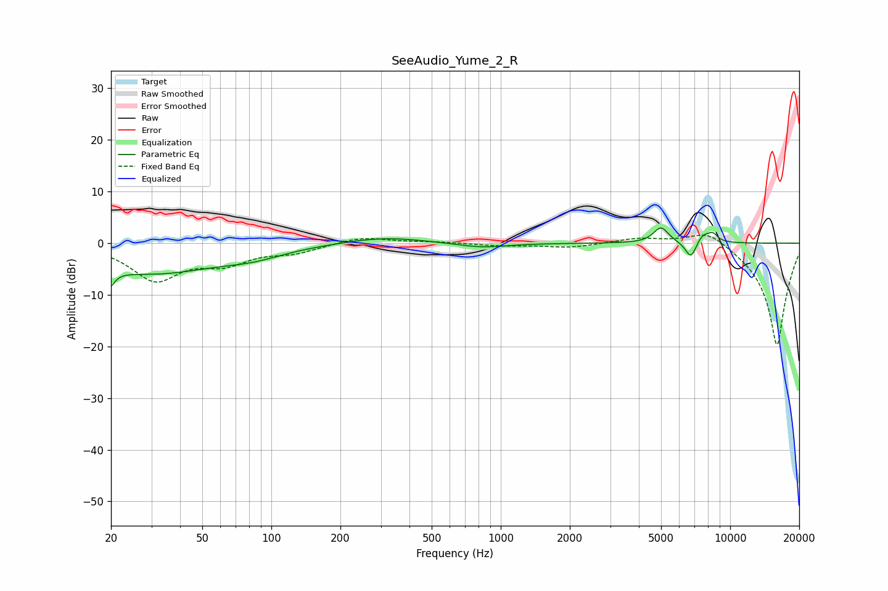

# SeeAudio_Yume_2_R
See [usage instructions](https://github.com/jaakkopasanen/AutoEq#usage) for more options and info.

### Parametric EQs
Apply preamp of -3.0 dB when using parametric equalizer.

|   # | Type    |   Fc (Hz) |    Q |   Gain (dB) |
|-----|---------|-----------|------|-------------|
|   1 | Peaking |        20 | 5.91 |        -6.4 |
|   2 | Peaking |        20 | 5.95 |         3.2 |
|   3 | Peaking |        30 | 0.46 |        -5.8 |
|   4 | Peaking |        84 | 1.13 |        -1.3 |
|   5 | Peaking |       309 | 0.82 |         1.3 |
|   6 | Peaking |       824 | 1.3  |        -0.9 |
|   7 | Peaking |      4995 | 4.25 |         3.1 |
|   8 | Peaking |      6756 | 5.46 |        -3.5 |
|   9 | Peaking |      7598 | 4.1  |         1.9 |
|  10 | Peaking |      8407 | 6    |         1.4 |

### Fixed Band EQs
When using fixed band (also called graphic) equalizer, apply preamp of **-1.6 dB** (if available) and set gains manually with these parameters.

|   # | Type    |   Fc (Hz) |    Q |   Gain (dB) |
|-----|---------|-----------|------|-------------|
|   1 | Peaking |        31 | 1.41 |        -6.9 |
|   2 | Peaking |        62 | 1.41 |        -3.3 |
|   3 | Peaking |       125 | 1.41 |        -1.6 |
|   4 | Peaking |       250 | 1.41 |         1.3 |
|   5 | Peaking |       500 | 1.41 |         0.3 |
|   6 | Peaking |      1000 | 1.41 |        -0.5 |
|   7 | Peaking |      2000 | 1.41 |        -0.8 |
|   8 | Peaking |      4000 | 1.41 |         1   |
|   9 | Peaking |      8000 | 1.41 |         3.1 |
|  10 | Peaking |     16000 | 1.41 |       -20   |

### Graphs

