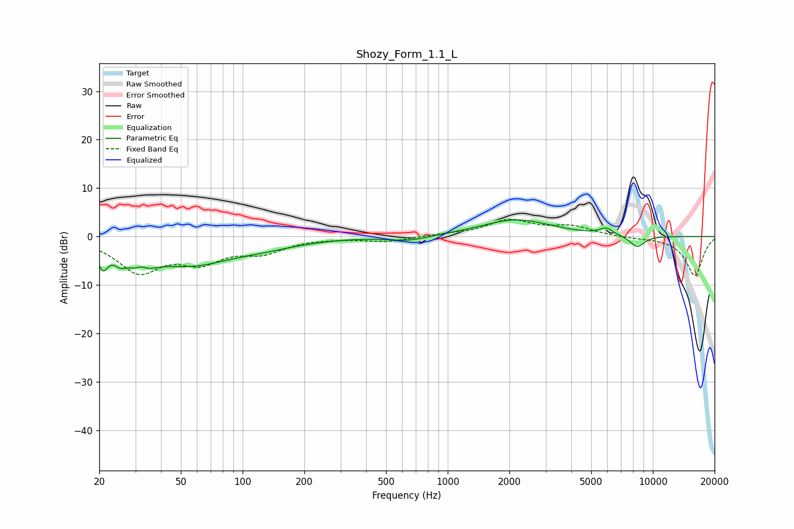

# Shozy_Form_1.1_L
See [usage instructions](https://github.com/jaakkopasanen/AutoEq#usage) for more options and info.

### Parametric EQs
Apply preamp of -3.5 dB when using parametric equalizer.

|   # | Type    |   Fc (Hz) |    Q |   Gain (dB) |
|-----|---------|-----------|------|-------------|
|   1 | Peaking |        21 | 5.94 |        -4.3 |
|   2 | Peaking |        25 | 4.33 |        -2.1 |
|   3 | Peaking |        32 | 3.02 |        -6.4 |
|   4 | Peaking |        32 | 4.43 |         4.2 |
|   5 | Peaking |        55 | 0.7  |        -5.3 |
|   6 | Peaking |       128 | 0.81 |        -1.3 |
|   7 | Peaking |       648 | 1.46 |        -1   |
|   8 | Peaking |      2155 | 0.83 |         3.5 |
|   9 | Peaking |      5922 | 4.3  |         1.4 |
|  10 | Peaking |      8388 | 3.57 |        -2.4 |

### Fixed Band EQs
When using fixed band (also called graphic) equalizer, apply preamp of **-3.7 dB** (if available) and set gains manually with these parameters.

|   # | Type    |   Fc (Hz) |    Q |   Gain (dB) |
|-----|---------|-----------|------|-------------|
|   1 | Peaking |        31 | 1.41 |        -6.9 |
|   2 | Peaking |        62 | 1.41 |        -4.4 |
|   3 | Peaking |       125 | 1.41 |        -2.8 |
|   4 | Peaking |       250 | 1.41 |        -0.1 |
|   5 | Peaking |       500 | 1.41 |        -1   |
|   6 | Peaking |      1000 | 1.41 |         0.3 |
|   7 | Peaking |      2000 | 1.41 |         3.2 |
|   8 | Peaking |      4000 | 1.41 |         1.9 |
|   9 | Peaking |      8000 | 1.41 |        -0.2 |
|  10 | Peaking |     16000 | 1.41 |        -8.1 |

### Graphs

