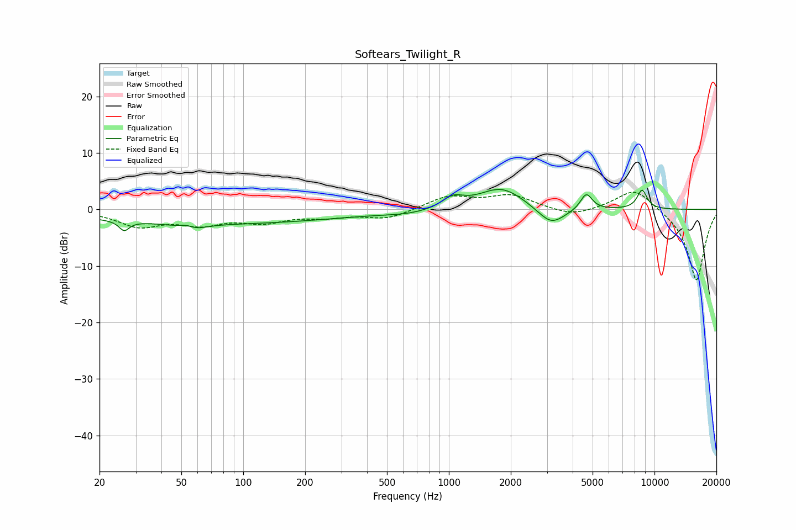

# Softears_Twilight_R
See [usage instructions](https://github.com/jaakkopasanen/AutoEq#usage) for more options and info.

### Parametric EQs
Apply preamp of -3.6 dB when using parametric equalizer.

|   # | Type    |   Fc (Hz) |    Q |   Gain (dB) |
|-----|---------|-----------|------|-------------|
|   1 | Peaking |        26 | 5.96 |        -1.7 |
|   2 | Peaking |        54 | 3.28 |         2.4 |
|   3 | Peaking |        55 | 2.59 |        -2.8 |
|   4 | Peaking |        72 | 0.22 |        -2.5 |
|   5 | Peaking |       637 | 1.14 |        -0.6 |
|   6 | Peaking |      1045 | 2.74 |         1.9 |
|   7 | Peaking |      1801 | 1.28 |         3.9 |
|   8 | Peaking |      3148 | 2.1  |        -3.3 |
|   9 | Peaking |      4661 | 4.92 |         2.9 |
|  10 | Peaking |      8699 | 5.33 |         3.4 |

### Fixed Band EQs
When using fixed band (also called graphic) equalizer, apply preamp of **-3.1 dB** (if available) and set gains manually with these parameters.

|   # | Type    |   Fc (Hz) |    Q |   Gain (dB) |
|-----|---------|-----------|------|-------------|
|   1 | Peaking |        31 | 1.41 |        -2.8 |
|   2 | Peaking |        62 | 1.41 |        -2.2 |
|   3 | Peaking |       125 | 1.41 |        -1.9 |
|   4 | Peaking |       250 | 1.41 |        -1.1 |
|   5 | Peaking |       500 | 1.41 |        -1.6 |
|   6 | Peaking |      1000 | 1.41 |         2.3 |
|   7 | Peaking |      2000 | 1.41 |         2.4 |
|   8 | Peaking |      4000 | 1.41 |        -1.3 |
|   9 | Peaking |      8000 | 1.41 |         4   |
|  10 | Peaking |     16000 | 1.41 |       -12.7 |

### Graphs

