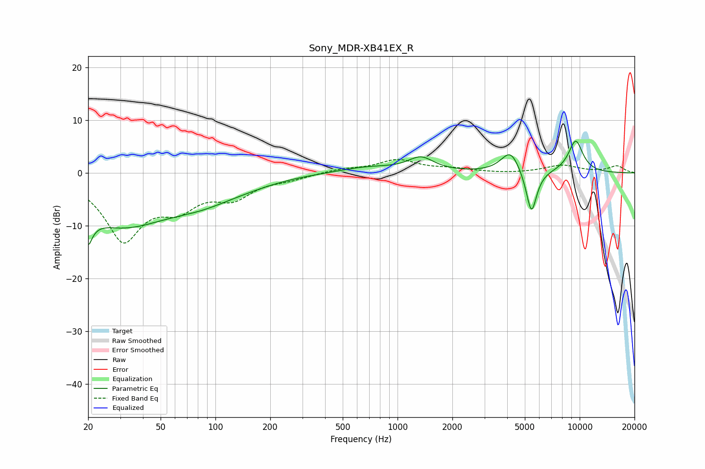

# Sony_MDR-XB41EX_R
See [usage instructions](https://github.com/jaakkopasanen/AutoEq#usage) for more options and info.

### Parametric EQs
Apply preamp of -6.1 dB when using parametric equalizer.

|   # | Type    |   Fc (Hz) |    Q |   Gain (dB) |
|-----|---------|-----------|------|-------------|
|   1 | Peaking |        20 | 5.73 |       -10.7 |
|   2 | Peaking |        20 | 6    |         5.1 |
|   3 | Peaking |        31 | 0.5  |        -9.5 |
|   4 | Peaking |        85 | 0.78 |        -2.6 |
|   5 | Peaking |       146 | 0.79 |        -1   |
|   6 | Peaking |       684 | 0.89 |         1.1 |
|   7 | Peaking |      1344 | 2    |         2.6 |
|   8 | Peaking |      4172 | 2.71 |         4.2 |
|   9 | Peaking |      5435 | 4.66 |        -8.5 |
|  10 | Peaking |      9508 | 3.02 |         6.1 |

### Fixed Band EQs
When using fixed band (also called graphic) equalizer, apply preamp of **-2.6 dB** (if available) and set gains manually with these parameters.

|   # | Type    |   Fc (Hz) |    Q |   Gain (dB) |
|-----|---------|-----------|------|-------------|
|   1 | Peaking |        31 | 1.41 |       -12.2 |
|   2 | Peaking |        62 | 1.41 |        -5   |
|   3 | Peaking |       125 | 1.41 |        -4   |
|   4 | Peaking |       250 | 1.41 |        -0.9 |
|   5 | Peaking |       500 | 1.41 |         0.7 |
|   6 | Peaking |      1000 | 1.41 |         2.4 |
|   7 | Peaking |      2000 | 1.41 |         0.6 |
|   8 | Peaking |      4000 | 1.41 |        -0.2 |
|   9 | Peaking |      8000 | 1.41 |         1.4 |
|  10 | Peaking |     16000 | 1.41 |         1.3 |

### Graphs

