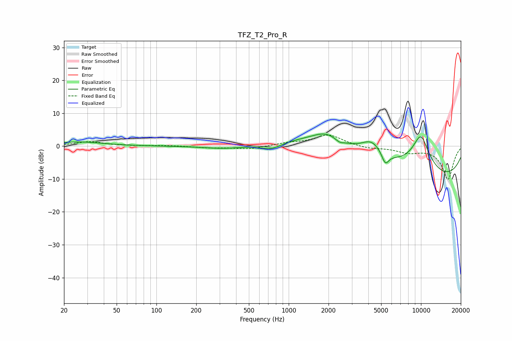

# TFZ_T2_Pro_R
See [usage instructions](https://github.com/jaakkopasanen/AutoEq#usage) for more options and info.

### Parametric EQs
Apply preamp of -3.8 dB when using parametric equalizer.

|   # | Type    |   Fc (Hz) |    Q |   Gain (dB) |
|-----|---------|-----------|------|-------------|
|   1 | Peaking |        26 | 0.79 |         1.3 |
|   2 | Peaking |       340 | 0.85 |        -1.3 |
|   3 | Peaking |       731 | 1.56 |        -2.5 |
|   4 | Peaking |      1923 | 1.3  |         3.5 |
|   5 | Peaking |      2421 | 4.6  |        -1   |
|   6 | Peaking |      3139 | 0.22 |         6.1 |
|   7 | Peaking |      4252 | 1.68 |         4.9 |
|   8 | Peaking |      5371 | 5.18 |        -3.6 |
|   9 | Peaking |      9296 | 0.2  |       -13.1 |
|  10 | Peaking |      9969 | 1.64 |        11.8 |

### Fixed Band EQs
When using fixed band (also called graphic) equalizer, apply preamp of **-3.4 dB** (if available) and set gains manually with these parameters.

|   # | Type    |   Fc (Hz) |    Q |   Gain (dB) |
|-----|---------|-----------|------|-------------|
|   1 | Peaking |        31 | 1.41 |         1.3 |
|   2 | Peaking |        62 | 1.41 |         0   |
|   3 | Peaking |       125 | 1.41 |         0.2 |
|   4 | Peaking |       250 | 1.41 |        -0.5 |
|   5 | Peaking |       500 | 1.41 |        -0.9 |
|   6 | Peaking |      1000 | 1.41 |         0.8 |
|   7 | Peaking |      2000 | 1.41 |         3.4 |
|   8 | Peaking |      4000 | 1.41 |        -0.8 |
|   9 | Peaking |      8000 | 1.41 |        -1.7 |
|  10 | Peaking |     16000 | 1.41 |       -10.1 |

### Graphs

