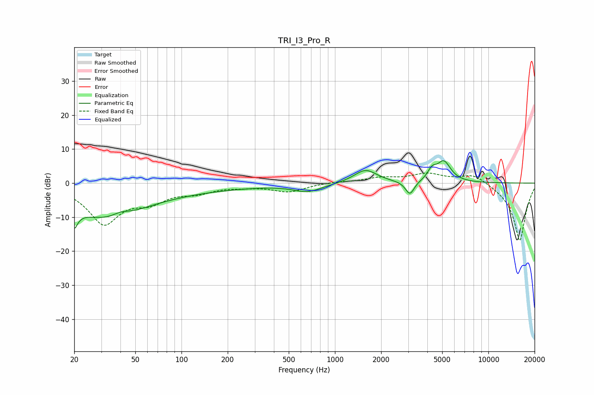

# TRI_I3_Pro_R
See [usage instructions](https://github.com/jaakkopasanen/AutoEq#usage) for more options and info.

### Parametric EQs
Apply preamp of -6.7 dB when using parametric equalizer.

|   # | Type    |   Fc (Hz) |    Q |   Gain (dB) |
|-----|---------|-----------|------|-------------|
|   1 | Peaking |        20 | 5.91 |       -10.6 |
|   2 | Peaking |        20 | 6    |         4.8 |
|   3 | Peaking |        32 | 0.57 |        -8.7 |
|   4 | Peaking |        40 | 2.76 |         1.3 |
|   5 | Peaking |        74 | 0.24 |        -1.8 |
|   6 | Peaking |       663 | 1.5  |        -2.4 |
|   7 | Peaking |      1582 | 1.89 |         4   |
|   8 | Peaking |      3078 | 4.89 |        -4.1 |
|   9 | Peaking |      4288 | 5.03 |         2.7 |
|  10 | Peaking |      5119 | 3.05 |         6   |

### Fixed Band EQs
When using fixed band (also called graphic) equalizer, apply preamp of **-3.1 dB** (if available) and set gains manually with these parameters.

|   # | Type    |   Fc (Hz) |    Q |   Gain (dB) |
|-----|---------|-----------|------|-------------|
|   1 | Peaking |        31 | 1.41 |       -11.5 |
|   2 | Peaking |        62 | 1.41 |        -4.2 |
|   3 | Peaking |       125 | 1.41 |        -2.2 |
|   4 | Peaking |       250 | 1.41 |        -0.7 |
|   5 | Peaking |       500 | 1.41 |        -2.5 |
|   6 | Peaking |      1000 | 1.41 |         0.4 |
|   7 | Peaking |      2000 | 1.41 |         1.4 |
|   8 | Peaking |      4000 | 1.41 |         2.6 |
|   9 | Peaking |      8000 | 1.41 |         2.9 |
|  10 | Peaking |     16000 | 1.41 |       -17.1 |

### Graphs

