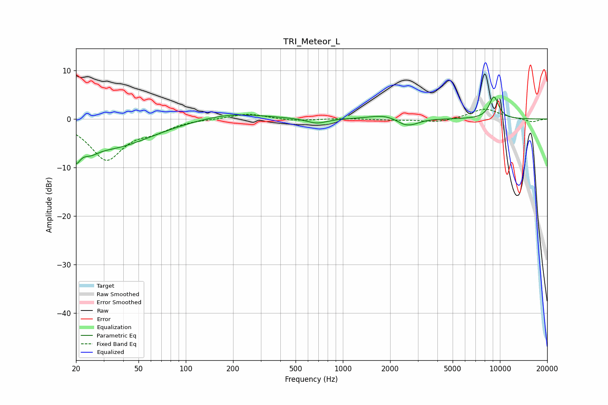

# TRI_Meteor_L
See [usage instructions](https://github.com/jaakkopasanen/AutoEq#usage) for more options and info.

### Parametric EQs
Apply preamp of -4.6 dB when using parametric equalizer.

|   # | Type    |   Fc (Hz) |    Q |   Gain (dB) |
|-----|---------|-----------|------|-------------|
|   1 | Peaking |        20 | 5.42 |        -6.3 |
|   2 | Peaking |        20 | 6    |         2.2 |
|   3 | Peaking |        25 | 2.62 |        -1.9 |
|   4 | Peaking |        34 | 0.56 |        -5.7 |
|   5 | Peaking |       192 | 0.67 |         1.3 |
|   6 | Peaking |       682 | 2.21 |        -1   |
|   7 | Peaking |      1818 | 1.55 |         0.9 |
|   8 | Peaking |      2477 | 2.71 |        -1.2 |
|   9 | Peaking |      2831 | 2.85 |        -0.6 |
|  10 | Peaking |      9158 | 4.08 |         4.6 |

### Fixed Band EQs
When using fixed band (also called graphic) equalizer, apply preamp of **-2.1 dB** (if available) and set gains manually with these parameters.

|   # | Type    |   Fc (Hz) |    Q |   Gain (dB) |
|-----|---------|-----------|------|-------------|
|   1 | Peaking |        31 | 1.41 |        -8.2 |
|   2 | Peaking |        62 | 1.41 |        -1.8 |
|   3 | Peaking |       125 | 1.41 |         0.1 |
|   4 | Peaking |       250 | 1.41 |         1.2 |
|   5 | Peaking |       500 | 1.41 |        -0.4 |
|   6 | Peaking |      1000 | 1.41 |         0.1 |
|   7 | Peaking |      2000 | 1.41 |        -0.2 |
|   8 | Peaking |      4000 | 1.41 |        -0.7 |
|   9 | Peaking |      8000 | 1.41 |         2.2 |
|  10 | Peaking |     16000 | 1.41 |        -0.6 |

### Graphs

