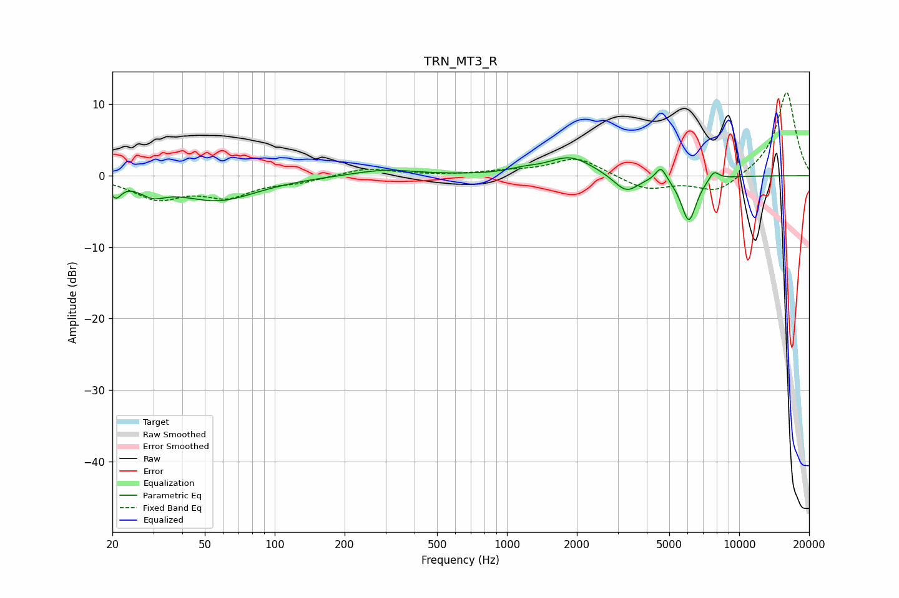

# TRN_MT3_R
See [usage instructions](https://github.com/jaakkopasanen/AutoEq#usage) for more options and info.

### Parametric EQs
Apply preamp of -2.6 dB when using parametric equalizer.

|   # | Type    |   Fc (Hz) |    Q |   Gain (dB) |
|-----|---------|-----------|------|-------------|
|   1 | Peaking |        21 | 5.99 |        -2.1 |
|   2 | Peaking |        30 | 2.52 |        -1.6 |
|   3 | Peaking |        57 | 0.83 |        -3.4 |
|   4 | Peaking |       296 | 1.05 |         0.9 |
|   5 | Peaking |      1173 | 2.27 |         0.5 |
|   6 | Peaking |      1873 | 1.45 |         2.6 |
|   7 | Peaking |      3262 | 2.61 |        -2.5 |
|   8 | Peaking |      4607 | 6    |         2   |
|   9 | Peaking |      6069 | 4.12 |        -6.4 |
|  10 | Peaking |      7786 | 5.99 |         1.3 |

### Fixed Band EQs
When using fixed band (also called graphic) equalizer, apply preamp of **-11.7 dB** (if available) and set gains manually with these parameters.

|   # | Type    |   Fc (Hz) |    Q |   Gain (dB) |
|-----|---------|-----------|------|-------------|
|   1 | Peaking |        31 | 1.41 |        -3   |
|   2 | Peaking |        62 | 1.41 |        -2.6 |
|   3 | Peaking |       125 | 1.41 |        -0.8 |
|   4 | Peaking |       250 | 1.41 |         1.1 |
|   5 | Peaking |       500 | 1.41 |         0   |
|   6 | Peaking |      1000 | 1.41 |         0.5 |
|   7 | Peaking |      2000 | 1.41 |         2.6 |
|   8 | Peaking |      4000 | 1.41 |        -2   |
|   9 | Peaking |      8000 | 1.41 |        -2.4 |
|  10 | Peaking |     16000 | 1.41 |        11.9 |

### Graphs

