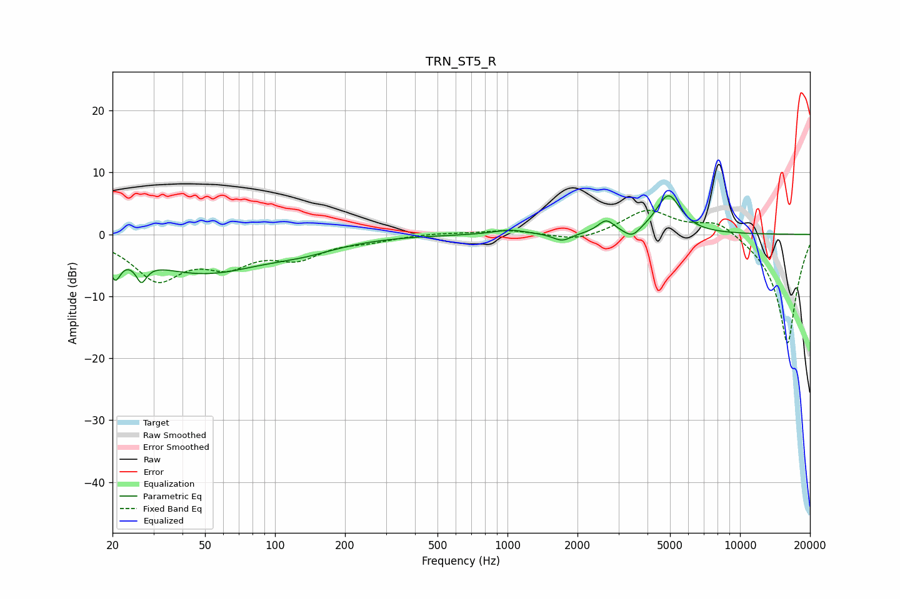

# TRN_ST5_R
See [usage instructions](https://github.com/jaakkopasanen/AutoEq#usage) for more options and info.

### Parametric EQs
Apply preamp of -6.3 dB when using parametric equalizer.

|   # | Type    |   Fc (Hz) |    Q |   Gain (dB) |
|-----|---------|-----------|------|-------------|
|   1 | Peaking |        21 | 6    |        -4.1 |
|   2 | Peaking |        27 | 5.94 |         3.2 |
|   3 | Peaking |        27 | 5.98 |        -6.4 |
|   4 | Peaking |        49 | 0.53 |        -6   |
|   5 | Peaking |       135 | 0.93 |        -1.4 |
|   6 | Peaking |      1023 | 2.05 |         0.8 |
|   7 | Peaking |      1718 | 3.59 |        -1.3 |
|   8 | Peaking |      2657 | 4.05 |         2.1 |
|   9 | Peaking |      3436 | 4.03 |        -1.6 |
|  10 | Peaking |      4920 | 2.63 |         6.3 |

### Fixed Band EQs
When using fixed band (also called graphic) equalizer, apply preamp of **-4.0 dB** (if available) and set gains manually with these parameters.

|   # | Type    |   Fc (Hz) |    Q |   Gain (dB) |
|-----|---------|-----------|------|-------------|
|   1 | Peaking |        31 | 1.41 |        -6.9 |
|   2 | Peaking |        62 | 1.41 |        -4.1 |
|   3 | Peaking |       125 | 1.41 |        -3.3 |
|   4 | Peaking |       250 | 1.41 |        -0.8 |
|   5 | Peaking |       500 | 1.41 |         0.3 |
|   6 | Peaking |      1000 | 1.41 |         0.7 |
|   7 | Peaking |      2000 | 1.41 |        -1.2 |
|   8 | Peaking |      4000 | 1.41 |         4   |
|   9 | Peaking |      8000 | 1.41 |         2.5 |
|  10 | Peaking |     16000 | 1.41 |       -17.9 |

### Graphs

