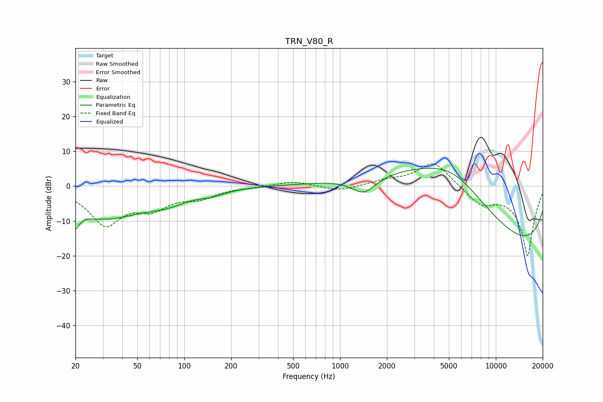

# TRN_V80_R
See [usage instructions](https://github.com/jaakkopasanen/AutoEq#usage) for more options and info.

### Parametric EQs
Apply preamp of -5.2 dB when using parametric equalizer.

|   # | Type    |   Fc (Hz) |    Q |   Gain (dB) |
|-----|---------|-----------|------|-------------|
|   1 | Peaking |        20 | 5.33 |        -8.6 |
|   2 | Peaking |        20 | 5.57 |         3.5 |
|   3 | Peaking |        31 | 0.53 |        -8.8 |
|   4 | Peaking |        77 | 1.13 |        -2.3 |
|   5 | Peaking |       150 | 1.74 |        -1.3 |
|   6 | Peaking |      1420 | 1.78 |        -5   |
|   7 | Peaking |      4545 | 0.27 |        11.2 |
|   8 | Peaking |      5278 | 0.45 |        14.2 |
|   9 | Peaking |      9751 | 0.18 |       -17.7 |
|  10 | Peaking |     10000 | 0.28 |        -7.7 |

### Fixed Band EQs
When using fixed band (also called graphic) equalizer, apply preamp of **-6.4 dB** (if available) and set gains manually with these parameters.

|   # | Type    |   Fc (Hz) |    Q |   Gain (dB) |
|-----|---------|-----------|------|-------------|
|   1 | Peaking |        31 | 1.41 |       -10.6 |
|   2 | Peaking |        62 | 1.41 |        -5.1 |
|   3 | Peaking |       125 | 1.41 |        -2.8 |
|   4 | Peaking |       250 | 1.41 |        -0.2 |
|   5 | Peaking |       500 | 1.41 |         1.5 |
|   6 | Peaking |      1000 | 1.41 |        -1.5 |
|   7 | Peaking |      2000 | 1.41 |         1.3 |
|   8 | Peaking |      4000 | 1.41 |         7.2 |
|   9 | Peaking |      8000 | 1.41 |        -4.7 |
|  10 | Peaking |     16000 | 1.41 |       -20   |

### Graphs

