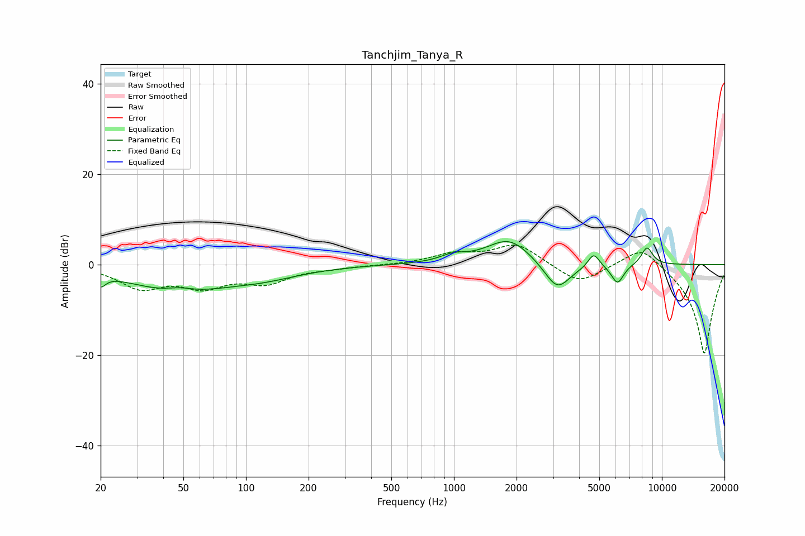

# Tanchjim_Tanya_R
See [usage instructions](https://github.com/jaakkopasanen/AutoEq#usage) for more options and info.

### Parametric EQs
Apply preamp of -5.2 dB when using parametric equalizer.

|   # | Type    |   Fc (Hz) |    Q |   Gain (dB) |
|-----|---------|-----------|------|-------------|
|   1 | Peaking |        20 | 5.94 |        -2.5 |
|   2 | Peaking |        47 | 0.61 |        -5.8 |
|   3 | Peaking |        48 | 2.11 |         1.2 |
|   4 | Peaking |       122 | 0.77 |        -2   |
|   5 | Peaking |       990 | 2.37 |         1.4 |
|   6 | Peaking |      1841 | 1.29 |         5.8 |
|   7 | Peaking |      3138 | 2.19 |        -6.4 |
|   8 | Peaking |      4700 | 5.16 |         3.2 |
|   9 | Peaking |      6115 | 4.62 |        -4.3 |
|  10 | Peaking |      8475 | 4.71 |         3.9 |

### Fixed Band EQs
When using fixed band (also called graphic) equalizer, apply preamp of **-4.4 dB** (if available) and set gains manually with these parameters.

|   # | Type    |   Fc (Hz) |    Q |   Gain (dB) |
|-----|---------|-----------|------|-------------|
|   1 | Peaking |        31 | 1.41 |        -4.8 |
|   2 | Peaking |        62 | 1.41 |        -4.3 |
|   3 | Peaking |       125 | 1.41 |        -3.6 |
|   4 | Peaking |       250 | 1.41 |        -0.6 |
|   5 | Peaking |       500 | 1.41 |        -0.1 |
|   6 | Peaking |      1000 | 1.41 |         2.2 |
|   7 | Peaking |      2000 | 1.41 |         4.6 |
|   8 | Peaking |      4000 | 1.41 |        -4.3 |
|   9 | Peaking |      8000 | 1.41 |         4.9 |
|  10 | Peaking |     16000 | 1.41 |       -20   |

### Graphs

