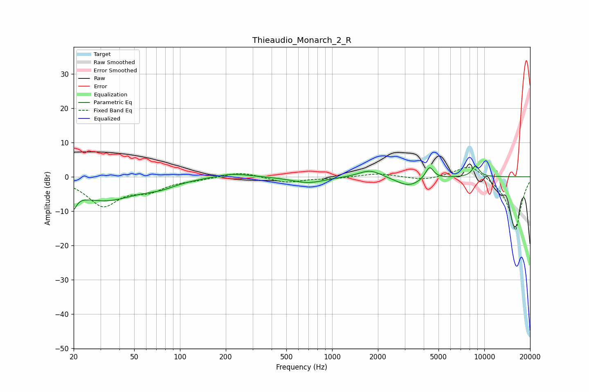

# Thieaudio_Monarch_2_R
See [usage instructions](https://github.com/jaakkopasanen/AutoEq#usage) for more options and info.

### Parametric EQs
Apply preamp of -3.3 dB when using parametric equalizer.

|   # | Type    |   Fc (Hz) |    Q |   Gain (dB) |
|-----|---------|-----------|------|-------------|
|   1 | Peaking |        20 | 5.88 |        -7.3 |
|   2 | Peaking |        20 | 5.99 |         2.7 |
|   3 | Peaking |        32 | 0.63 |        -6.7 |
|   4 | Peaking |        75 | 1.48 |        -1.3 |
|   5 | Peaking |       220 | 1.21 |         1.2 |
|   6 | Peaking |       696 | 1.32 |        -1.8 |
|   7 | Peaking |      1775 | 1.9  |         2.3 |
|   8 | Peaking |      3189 | 1.68 |        -2.8 |
|   9 | Peaking |      4365 | 5.21 |         3.7 |
|  10 | Peaking |      8772 | 5.21 |         3.2 |

### Fixed Band EQs
When using fixed band (also called graphic) equalizer, apply preamp of **-2.9 dB** (if available) and set gains manually with these parameters.

|   # | Type    |   Fc (Hz) |    Q |   Gain (dB) |
|-----|---------|-----------|------|-------------|
|   1 | Peaking |        31 | 1.41 |        -8.2 |
|   2 | Peaking |        62 | 1.41 |        -3.3 |
|   3 | Peaking |       125 | 1.41 |        -0.6 |
|   4 | Peaking |       250 | 1.41 |         1.5 |
|   5 | Peaking |       500 | 1.41 |        -1.7 |
|   6 | Peaking |      1000 | 1.41 |        -0.4 |
|   7 | Peaking |      2000 | 1.41 |         1   |
|   8 | Peaking |      4000 | 1.41 |        -1   |
|   9 | Peaking |      8000 | 1.41 |         4   |
|  10 | Peaking |     16000 | 1.41 |       -15.8 |

### Graphs

