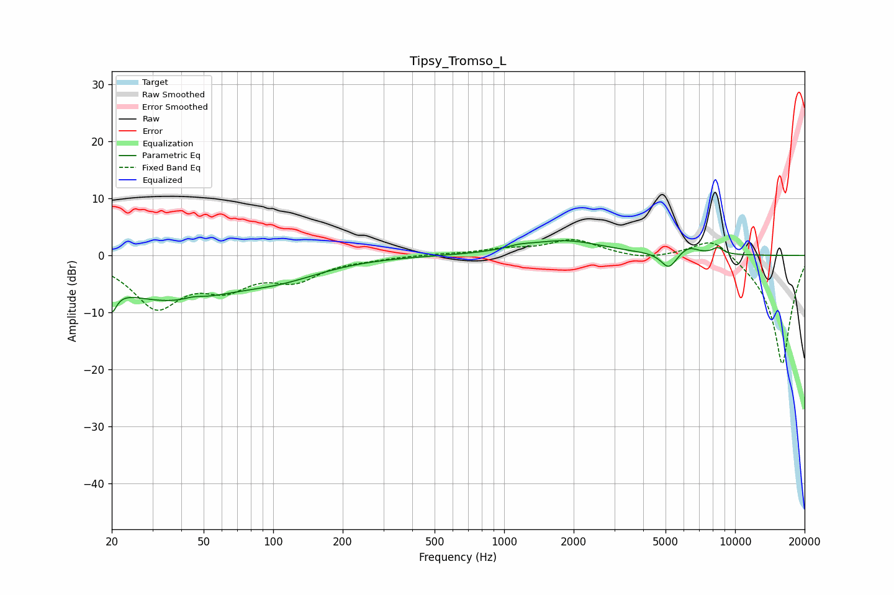

# Tipsy_Tromso_L
See [usage instructions](https://github.com/jaakkopasanen/AutoEq#usage) for more options and info.

### Parametric EQs
Apply preamp of -2.7 dB when using parametric equalizer.

|   # | Type    |   Fc (Hz) |    Q |   Gain (dB) |
|-----|---------|-----------|------|-------------|
|   1 | Peaking |        20 | 5.88 |        -7.9 |
|   2 | Peaking |        20 | 5.32 |         3.7 |
|   3 | Peaking |        35 | 0.48 |        -7.5 |
|   4 | Peaking |        45 | 3.5  |         0.5 |
|   5 | Peaking |       111 | 0.78 |        -2.2 |
|   6 | Peaking |      1161 | 2.62 |         0.5 |
|   7 | Peaking |      1827 | 0.86 |         2.5 |
|   8 | Peaking |      5162 | 4.22 |        -2.8 |
|   9 | Peaking |      6295 | 3.34 |         1.4 |
|  10 | Peaking |      8416 | 5.2  |         1.1 |

### Fixed Band EQs
When using fixed band (also called graphic) equalizer, apply preamp of **-2.9 dB** (if available) and set gains manually with these parameters.

|   # | Type    |   Fc (Hz) |    Q |   Gain (dB) |
|-----|---------|-----------|------|-------------|
|   1 | Peaking |        31 | 1.41 |        -8.6 |
|   2 | Peaking |        62 | 1.41 |        -4.5 |
|   3 | Peaking |       125 | 1.41 |        -3.8 |
|   4 | Peaking |       250 | 1.41 |        -0.4 |
|   5 | Peaking |       500 | 1.41 |         0.2 |
|   6 | Peaking |      1000 | 1.41 |         0.9 |
|   7 | Peaking |      2000 | 1.41 |         2.7 |
|   8 | Peaking |      4000 | 1.41 |        -0.7 |
|   9 | Peaking |      8000 | 1.41 |         3.8 |
|  10 | Peaking |     16000 | 1.41 |       -19.3 |

### Graphs

