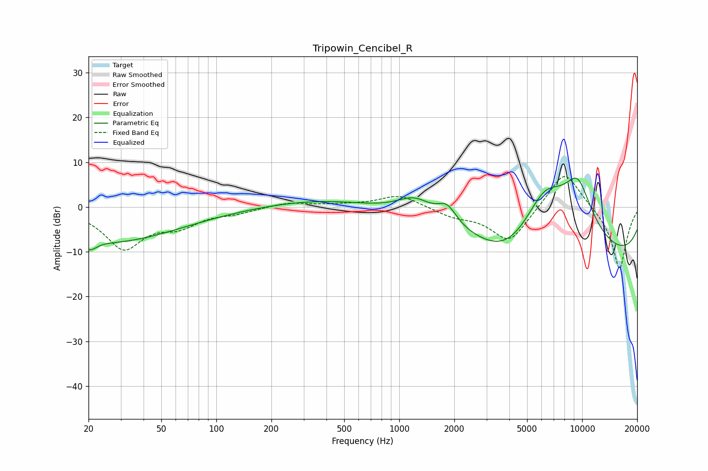

# Tripowin_Cencibel_R
See [usage instructions](https://github.com/jaakkopasanen/AutoEq#usage) for more options and info.

### Parametric EQs
Apply preamp of -6.5 dB when using parametric equalizer.

|   # | Type    |   Fc (Hz) |    Q |   Gain (dB) |
|-----|---------|-----------|------|-------------|
|   1 | Peaking |        20 | 3.19 |        -2.5 |
|   2 | Peaking |        24 | 4.74 |         0.1 |
|   3 | Peaking |        27 | 0.38 |        -7.6 |
|   4 | Peaking |       393 | 0.46 |         1.8 |
|   5 | Peaking |      1217 | 1.43 |         4.3 |
|   6 | Peaking |      1827 | 2.67 |         4   |
|   7 | Peaking |      3919 | 0.73 |        -8.9 |
|   8 | Peaking |      6225 | 0.65 |        19.6 |
|   9 | Peaking |      9464 | 1.43 |        11.8 |
|  10 | Peaking |      9761 | 0.18 |       -15.5 |

### Fixed Band EQs
When using fixed band (also called graphic) equalizer, apply preamp of **-6.9 dB** (if available) and set gains manually with these parameters.

|   # | Type    |   Fc (Hz) |    Q |   Gain (dB) |
|-----|---------|-----------|------|-------------|
|   1 | Peaking |        31 | 1.41 |        -9   |
|   2 | Peaking |        62 | 1.41 |        -3.5 |
|   3 | Peaking |       125 | 1.41 |        -1   |
|   4 | Peaking |       250 | 1.41 |         1.1 |
|   5 | Peaking |       500 | 1.41 |         0.4 |
|   6 | Peaking |      1000 | 1.41 |         2.8 |
|   7 | Peaking |      2000 | 1.41 |        -1.8 |
|   8 | Peaking |      4000 | 1.41 |        -8   |
|   9 | Peaking |      8000 | 1.41 |         9.1 |
|  10 | Peaking |     16000 | 1.41 |       -14.2 |

### Graphs

