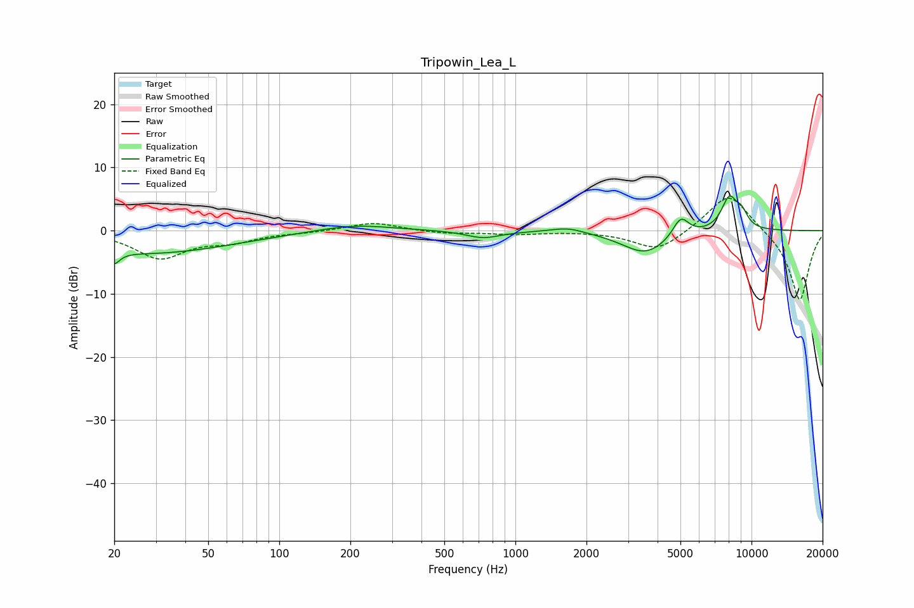

# Tripowin_Lea_L
See [usage instructions](https://github.com/jaakkopasanen/AutoEq#usage) for more options and info.

### Parametric EQs
Apply preamp of -5.6 dB when using parametric equalizer.

|   # | Type    |   Fc (Hz) |    Q |   Gain (dB) |
|-----|---------|-----------|------|-------------|
|   1 | Peaking |        20 | 5.92 |        -3.9 |
|   2 | Peaking |        20 | 5.99 |         2   |
|   3 | Peaking |        28 | 0.4  |        -3.6 |
|   4 | Peaking |       207 | 0.89 |         1.1 |
|   5 | Peaking |       730 | 1.93 |        -1.2 |
|   6 | Peaking |      1664 | 2.03 |         0.8 |
|   7 | Peaking |      3554 | 1.41 |        -3.7 |
|   8 | Peaking |      5016 | 4.06 |         3.2 |
|   9 | Peaking |      8056 | 3.83 |         5.1 |
|  10 | Peaking |      9094 | 4.93 |         2.1 |

### Fixed Band EQs
When using fixed band (also called graphic) equalizer, apply preamp of **-5.2 dB** (if available) and set gains manually with these parameters.

|   # | Type    |   Fc (Hz) |    Q |   Gain (dB) |
|-----|---------|-----------|------|-------------|
|   1 | Peaking |        31 | 1.41 |        -4.2 |
|   2 | Peaking |        62 | 1.41 |        -1.5 |
|   3 | Peaking |       125 | 1.41 |        -0.2 |
|   4 | Peaking |       250 | 1.41 |         1.3 |
|   5 | Peaking |       500 | 1.41 |        -0.5 |
|   6 | Peaking |      1000 | 1.41 |        -0.5 |
|   7 | Peaking |      2000 | 1.41 |        -0   |
|   8 | Peaking |      4000 | 1.41 |        -3.3 |
|   9 | Peaking |      8000 | 1.41 |         6.3 |
|  10 | Peaking |     16000 | 1.41 |       -11.2 |

### Graphs

