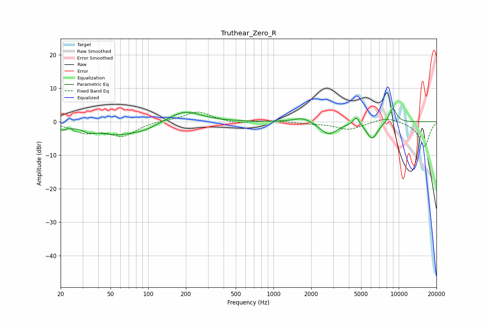

# Truthear_Zero_R
See [usage instructions](https://github.com/jaakkopasanen/AutoEq#usage) for more options and info.

### Parametric EQs
Apply preamp of -4.0 dB when using parametric equalizer.

|   # | Type    |   Fc (Hz) |    Q |   Gain (dB) |
|-----|---------|-----------|------|-------------|
|   1 | Peaking |        20 | 2.86 |        -1.6 |
|   2 | Peaking |        33 | 3.15 |        -1.1 |
|   3 | Peaking |        57 | 0.77 |        -3.9 |
|   4 | Peaking |        96 | 1.83 |        -0.9 |
|   5 | Peaking |       197 | 1.11 |         3.5 |
|   6 | Peaking |      1716 | 2.01 |         1.5 |
|   7 | Peaking |      2758 | 2.1  |        -3.8 |
|   8 | Peaking |      4586 | 5.55 |         2.5 |
|   9 | Peaking |      6134 | 3.01 |        -5.1 |
|  10 | Peaking |      8971 | 4.29 |         4.5 |

### Fixed Band EQs
When using fixed band (also called graphic) equalizer, apply preamp of **-3.0 dB** (if available) and set gains manually with these parameters.

|   # | Type    |   Fc (Hz) |    Q |   Gain (dB) |
|-----|---------|-----------|------|-------------|
|   1 | Peaking |        31 | 1.41 |        -2.9 |
|   2 | Peaking |        62 | 1.41 |        -4   |
|   3 | Peaking |       125 | 1.41 |         0.4 |
|   4 | Peaking |       250 | 1.41 |         3.1 |
|   5 | Peaking |       500 | 1.41 |        -0.7 |
|   6 | Peaking |      1000 | 1.41 |         0.4 |
|   7 | Peaking |      2000 | 1.41 |        -0.5 |
|   8 | Peaking |      4000 | 1.41 |        -2.3 |
|   9 | Peaking |      8000 | 1.41 |         1.5 |
|  10 | Peaking |     16000 | 1.41 |        -7.4 |

### Graphs

