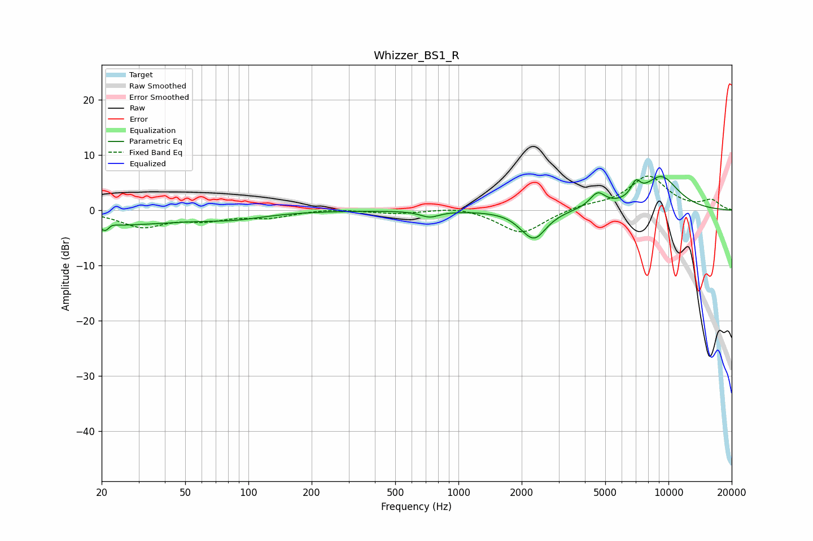

# Whizzer_BS1_R
See [usage instructions](https://github.com/jaakkopasanen/AutoEq#usage) for more options and info.

### Parametric EQs
Apply preamp of -6.2 dB when using parametric equalizer.

|   # | Type    |   Fc (Hz) |    Q |   Gain (dB) |
|-----|---------|-----------|------|-------------|
|   1 | Peaking |        21 | 5.87 |        -2.8 |
|   2 | Peaking |        21 | 0.37 |        -2.6 |
|   3 | Peaking |        22 | 5.92 |         2.1 |
|   4 | Peaking |        86 | 0.98 |        -0.9 |
|   5 | Peaking |       730 | 3.15 |        -1.1 |
|   6 | Peaking |      2028 | 3.06 |        -0.6 |
|   7 | Peaking |      2306 | 2.47 |        -4.9 |
|   8 | Peaking |      4598 | 3.75 |         2.6 |
|   9 | Peaking |      6986 | 5.94 |         2.5 |
|  10 | Peaking |      9228 | 1.45 |         6   |

### Fixed Band EQs
When using fixed band (also called graphic) equalizer, apply preamp of **-6.3 dB** (if available) and set gains manually with these parameters.

|   # | Type    |   Fc (Hz) |    Q |   Gain (dB) |
|-----|---------|-----------|------|-------------|
|   1 | Peaking |        31 | 1.41 |        -2.9 |
|   2 | Peaking |        62 | 1.41 |        -1.5 |
|   3 | Peaking |       125 | 1.41 |        -1.2 |
|   4 | Peaking |       250 | 1.41 |         0.3 |
|   5 | Peaking |       500 | 1.41 |        -0.6 |
|   6 | Peaking |      1000 | 1.41 |         0.8 |
|   7 | Peaking |      2000 | 1.41 |        -4.3 |
|   8 | Peaking |      4000 | 1.41 |         0.8 |
|   9 | Peaking |      8000 | 1.41 |         6.1 |
|  10 | Peaking |     16000 | 1.41 |         1.7 |

### Graphs

