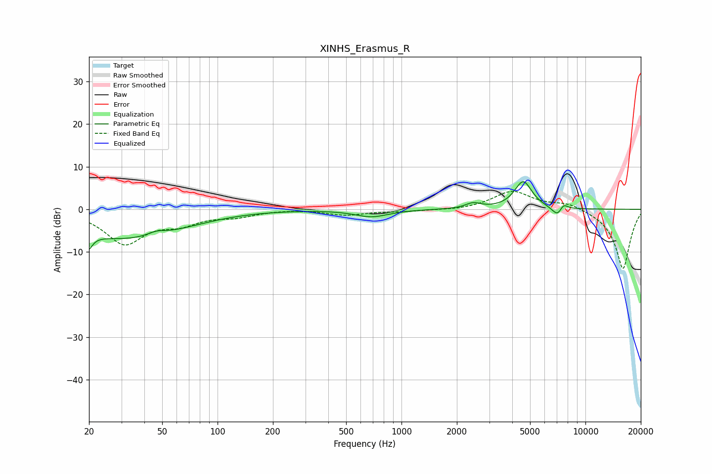

# XINHS_Erasmus_R
See [usage instructions](https://github.com/jaakkopasanen/AutoEq#usage) for more options and info.

### Parametric EQs
Apply preamp of -6.5 dB when using parametric equalizer.

|   # | Type    |   Fc (Hz) |    Q |   Gain (dB) |
|-----|---------|-----------|------|-------------|
|   1 | Peaking |        20 | 5.76 |        -6.9 |
|   2 | Peaking |        20 | 5.96 |         3.1 |
|   3 | Peaking |        29 | 0.51 |        -6.2 |
|   4 | Peaking |        47 | 3.12 |         0.9 |
|   5 | Peaking |        59 | 0.65 |        -1.2 |
|   6 | Peaking |       688 | 1.54 |        -1.7 |
|   7 | Peaking |      2453 | 3.44 |         1.3 |
|   8 | Peaking |      4590 | 2.91 |         6.5 |
|   9 | Peaking |      7119 | 4.33 |        -2.8 |
|  10 | Peaking |      7544 | 5.42 |         2.1 |

### Fixed Band EQs
When using fixed band (also called graphic) equalizer, apply preamp of **-4.3 dB** (if available) and set gains manually with these parameters.

|   # | Type    |   Fc (Hz) |    Q |   Gain (dB) |
|-----|---------|-----------|------|-------------|
|   1 | Peaking |        31 | 1.41 |        -7.8 |
|   2 | Peaking |        62 | 1.41 |        -2.7 |
|   3 | Peaking |       125 | 1.41 |        -1.4 |
|   4 | Peaking |       250 | 1.41 |         0.1 |
|   5 | Peaking |       500 | 1.41 |        -1.3 |
|   6 | Peaking |      1000 | 1.41 |        -0.4 |
|   7 | Peaking |      2000 | 1.41 |        -0.3 |
|   8 | Peaking |      4000 | 1.41 |         4.3 |
|   9 | Peaking |      8000 | 1.41 |         1.6 |
|  10 | Peaking |     16000 | 1.41 |       -14.1 |

### Graphs

