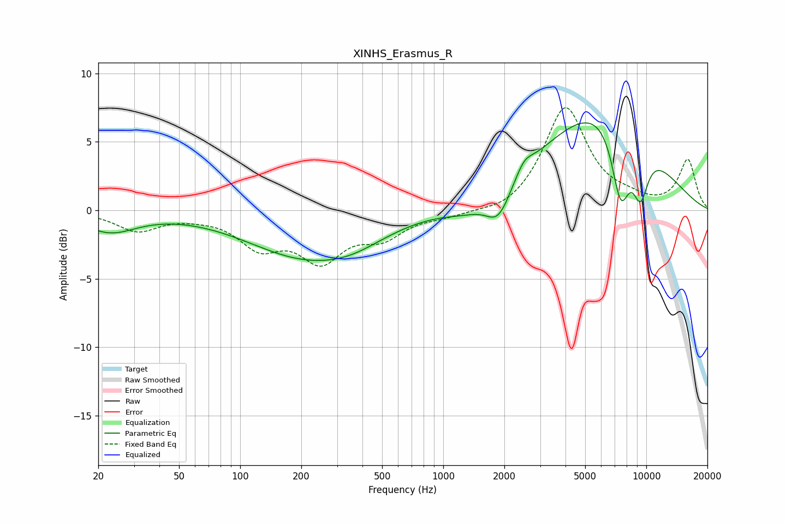

# XINHS_Erasmus_R
See [usage instructions](https://github.com/jaakkopasanen/AutoEq#usage) for more options and info.

### Parametric EQs
Apply preamp of -6.5 dB when using parametric equalizer.

|   # | Type    |   Fc (Hz) |    Q |   Gain (dB) |
|-----|---------|-----------|------|-------------|
|   1 | Peaking |        23 | 1.09 |        -1.5 |
|   2 | Peaking |       206 | 0.49 |        -3.1 |
|   3 | Peaking |       356 | 0.86 |        -0.9 |
|   4 | Peaking |      1299 | 1.26 |        -0.7 |
|   5 | Peaking |      1868 | 2.27 |        -2.4 |
|   6 | Peaking |      2502 | 3.43 |         0.9 |
|   7 | Peaking |      4117 | 0.5  |         2.4 |
|   8 | Peaking |      6837 | 0.54 |         5.9 |
|   9 | Peaking |      7479 | 2.86 |        -5.6 |
|  10 | Peaking |      9355 | 3.12 |        -3.8 |

### Fixed Band EQs
When using fixed band (also called graphic) equalizer, apply preamp of **-7.6 dB** (if available) and set gains manually with these parameters.

|   # | Type    |   Fc (Hz) |    Q |   Gain (dB) |
|-----|---------|-----------|------|-------------|
|   1 | Peaking |        31 | 1.41 |        -1.4 |
|   2 | Peaking |        62 | 1.41 |        -0.2 |
|   3 | Peaking |       125 | 1.41 |        -2.4 |
|   4 | Peaking |       250 | 1.41 |        -3.3 |
|   5 | Peaking |       500 | 1.41 |        -1.7 |
|   6 | Peaking |      1000 | 1.41 |        -0.4 |
|   7 | Peaking |      2000 | 1.41 |        -0.5 |
|   8 | Peaking |      4000 | 1.41 |         7.5 |
|   9 | Peaking |      8000 | 1.41 |         0.5 |
|  10 | Peaking |     16000 | 1.41 |         3.6 |

### Graphs

