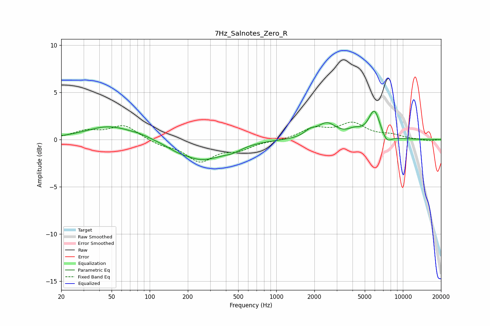

# 7Hz_Salnotes_Zero_R
See [usage instructions](https://github.com/jaakkopasanen/AutoEq#usage) for more options and info.

### Parametric EQs
Apply preamp of -3.1 dB when using parametric equalizer.

|   # | Type    |   Fc (Hz) |    Q |   Gain (dB) |
|-----|---------|-----------|------|-------------|
|   1 | Peaking |        48 | 0.76 |         1.4 |
|   2 | Peaking |        84 | 1.88 |         0.2 |
|   3 | Peaking |       162 | 1.78 |        -0.3 |
|   4 | Peaking |       260 | 0.85 |        -2.1 |
|   5 | Peaking |       453 | 1.91 |        -0.5 |
|   6 | Peaking |      1847 | 3.11 |         0.6 |
|   7 | Peaking |      2513 | 1.93 |         1.6 |
|   8 | Peaking |      4150 | 2.57 |         0.6 |
|   9 | Peaking |      5949 | 2.98 |         3   |
|  10 | Peaking |      7434 | 3.59 |        -0.9 |

### Fixed Band EQs
When using fixed band (also called graphic) equalizer, apply preamp of **-1.9 dB** (if available) and set gains manually with these parameters.

|   # | Type    |   Fc (Hz) |    Q |   Gain (dB) |
|-----|---------|-----------|------|-------------|
|   1 | Peaking |        31 | 1.41 |         0.8 |
|   2 | Peaking |        62 | 1.41 |         1.5 |
|   3 | Peaking |       125 | 1.41 |        -0.5 |
|   4 | Peaking |       250 | 1.41 |        -2.2 |
|   5 | Peaking |       500 | 1.41 |        -0.9 |
|   6 | Peaking |      1000 | 1.41 |        -0.1 |
|   7 | Peaking |      2000 | 1.41 |         1.1 |
|   8 | Peaking |      4000 | 1.41 |         1.6 |
|   9 | Peaking |      8000 | 1.41 |         0.4 |
|  10 | Peaking |     16000 | 1.41 |        -0.2 |

### Graphs

