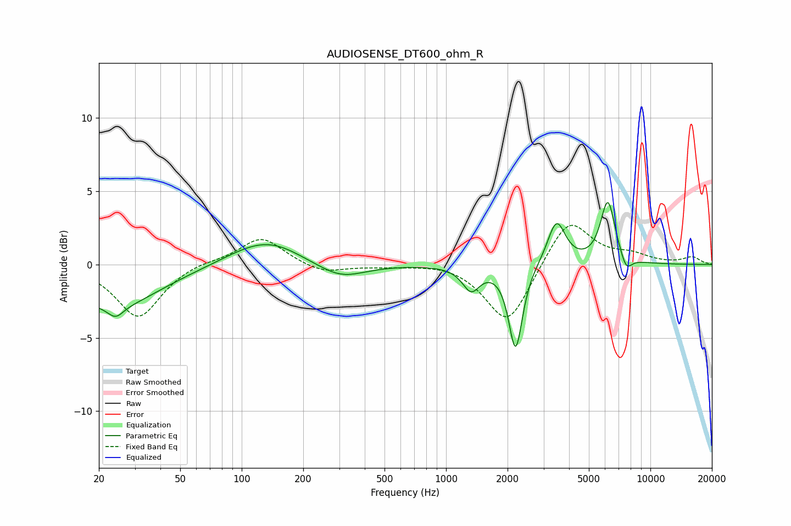

# AUDIOSENSE_DT600_ohm_R
See [usage instructions](https://github.com/jaakkopasanen/AutoEq#usage) for more options and info.

### Parametric EQs
Apply preamp of -4.3 dB when using parametric equalizer.

|   # | Type    |   Fc (Hz) |    Q |   Gain (dB) |
|-----|---------|-----------|------|-------------|
|   1 | Peaking |        23 | 0.62 |        -2.9 |
|   2 | Peaking |        24 | 3.87 |        -0.7 |
|   3 | Peaking |       120 | 0.84 |         1.4 |
|   4 | Peaking |       151 | 1.15 |         0.5 |
|   5 | Peaking |       306 | 1.22 |        -1   |
|   6 | Peaking |      1326 | 3.34 |        -1.6 |
|   7 | Peaking |      2190 | 4.25 |        -5.8 |
|   8 | Peaking |      3471 | 3.23 |         3   |
|   9 | Peaking |      6192 | 3.81 |         4.3 |
|  10 | Peaking |      7617 | 4.93 |        -1   |

### Fixed Band EQs
When using fixed band (also called graphic) equalizer, apply preamp of **-2.8 dB** (if available) and set gains manually with these parameters.

|   # | Type    |   Fc (Hz) |    Q |   Gain (dB) |
|-----|---------|-----------|------|-------------|
|   1 | Peaking |        31 | 1.41 |        -3.6 |
|   2 | Peaking |        62 | 1.41 |         0.3 |
|   3 | Peaking |       125 | 1.41 |         1.9 |
|   4 | Peaking |       250 | 1.41 |        -0.6 |
|   5 | Peaking |       500 | 1.41 |        -0.1 |
|   6 | Peaking |      1000 | 1.41 |         0.2 |
|   7 | Peaking |      2000 | 1.41 |        -4.2 |
|   8 | Peaking |      4000 | 1.41 |         3.3 |
|   9 | Peaking |      8000 | 1.41 |         0.6 |
|  10 | Peaking |     16000 | 1.41 |         0.5 |

### Graphs

